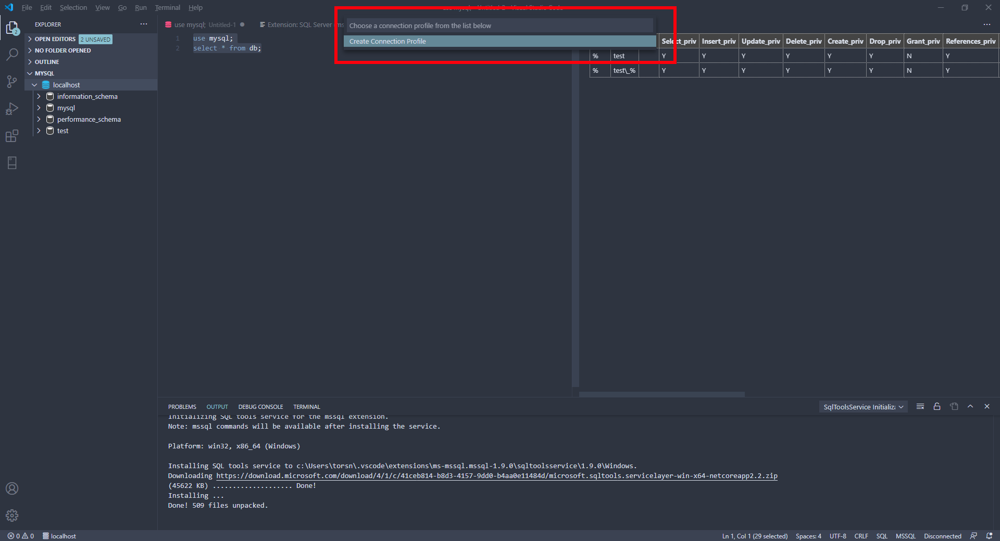

## Should I install XAMPP or just MySQL?

Either is fine but with XAMPP you will need to remember to start and 
stop the server. **Note**: XAMPP comes with MariaDB, not MySQL so see below
for issues you might have with, e.g. MySQL Workbench and MariaDB.

## What is the difference between MariaDB and MySQL

MySQL was bought by Oracle and after that people forked an open source version
which is called MariaDB. They work basically the same but there are some
differences like removing password authentication by default. 

## Should I install MariaDB or MySQL

I'd recommend MariaDB. I use MariaDB on my machines and didn't run into as many
connection issues with MariaDB.

## Visual Studio and Visual Studio Code

These are 2 completely different programs which, like Java and Javascript, are
not at all alike. You need Visual Studio Code for this module.

## Do I have to use Visual Studio Code?

No, but it's what I'll be using for my in-lecture demos. The
[HeidiSQL](https://www.heidisql.com/) program that comes with MariaDB is a good
alternative.

## The instructions refer to a command line, what's that?

This is the windows command line. It is possible through XAMPP or the start
menu to get a connection to the database though a command line but this won't
let you run the utility programs that come with the database. What you want is
the first image below, not the second.

 


If you've installed MariaDB, then you can get a command prompt with the path
automatically set up. Use the Windows start menu to find the top highlighted
tool listed in the image below. Macs and Linux don't usually have these path
problems.


## I get an error that either mysql or mysqldump can't be found

On Windows the installer doesn't always set the PATH correctly. You just need
to specify the full path to the command. For example, 
`C:\Program Files\MariaDB 10.2\bin\mysqldump` on windows instead of 
just `mysqldump`. 

## When I try to run my SQL I get a 'Choose a connection profile' dialog box



This seems to be caused my installing the mssql extension along with the mysql
extension. What's annoying is VS Code often recommends you install this once
you open a sql file. Mssql is Microsoft SQL Server which is a different
database server entirely. This extension seems to override the MySQL
connection. The best thing to do is [uninstall this extension](https://code.visualstudio.com/docs/editor/extension-gallery#_uninstall-an-extension)

## `ER_NOT_SUPPORTED_AUTH_MODE` error when connecting

This is because MySQL 8 by default doesn't allow password authentication. You 
need to change the connection method. Log into mysql either with the command 
line or mysql admin and run:

`ALTER USER 'root'@'localhost' IDENTIFIED WITH mysql_native_password BY 'password';`

This is because Oracle's MySQL server removed password authentication by
default.  You likely will have to remove and log in again with VSCode. Also
note that the password is now the word password.

See <https://stackoverflow.com/questions/50058581/er-not-supported-auth-mode-sails-1-0-and-mysql-8-0> for more information.

## mysqldump gives an error like `Unknown table 'COLUMN_STATISTICS' in information_schema`

This is due to an incompatibility with using a MariaDB server with MySQL
command line tools. You need to add the `--column-statistics=0` flag to
mysqldump so something like:

```
mysqldump -u root --databases Company --column-statistics=0 > database.sql
```

See <https://serverfault.com/questions/912162/mysqldump-throws-unknown-table-column-statistics-in-information-schema-1109> for more information.

## MySQL Workbench gives me an error to update my client

This is because you are connecting MySQL Workbench to a MariaDB server. It's
not a major issue.


