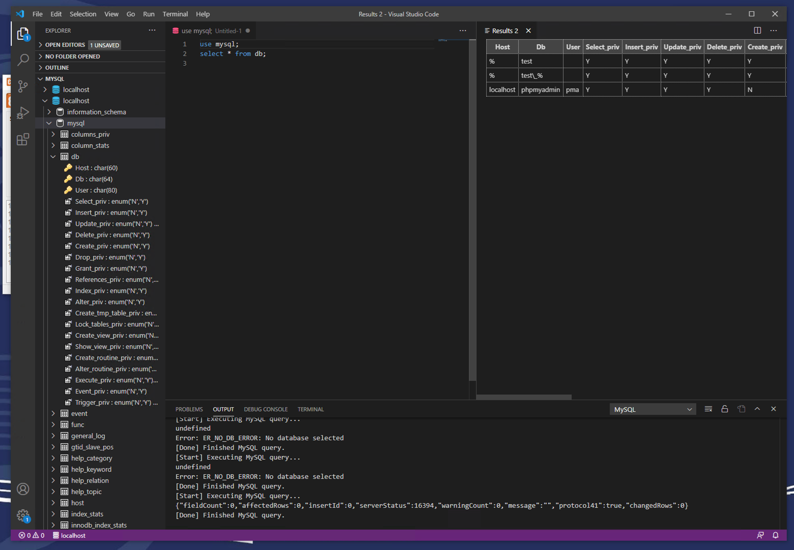

This lab is to get you up and running with MySQL. This will get you familiar 
with starting and stopping the database on the lab machines, loading, and 
restoring your database. During the semester you'll be doing this every lab
so I thought it best you'd get practice now :) 

Keep this lab sheet because it has the instructions for starting/stopping
the database and restoring/backing up your database.

The writeup for this lab assumes you are using the lab machines and Visual 
Studio Code. Both of these should be installed and working on the lab machines.
You can use another other text editor or database connection if you want, but
we won't be able to offer the same level of support.

# Goals

To complete this lab you need to:

1. Show the demonstrator the results of your select query
2. Show the demonstrator the backup file you've created of the database

The steps for this lab (and the framework of future labs is):

1. Start the MySQL server on the lab machine
2. (optional) Open and configure Visual Studio code
3. Load the database backup needed for the lab (provided in this lab)
4. Work with the database
5. Back up your database to a file kept in a safe place

# Start the MySQL server on the lab machine

MySQL is not started by default on the lab machines. 

1. Load the Sql command line app. Science->Computer Science->XAMPP

   

2. Start mysql by clicking the "start" button

   

3. Click the "shell" button to get to the command line
4. Make sure you can connect to the mysql server: `mysql.exe -u root mysql`.
   If you are asked for a password the default password is blank so just hit
   enter. If you get a login error then you can try 'mysql' for the password.

# Open and configure Visual Studio code

There are many text editors and Visual Studio Code is one of them. If you're 
more comfortable with some other text editor that's fine but you cannot use
Notepad or Word for this module. They are not designed for coding and will 
cause more problems than they solve. 

## Install MySQL extension

You may need to reinstall the MySQL plugin every time you use a new lab 
machine. I'm not sure if the plugins are stored with your roving profile so
you may need to redo this each lab. Luckily the steps are easy :)


1. Open Visual Studio Code from the lab applications. Science -> Computer Science -> Visual Studio Code

   

2. Install the [MySQL vscode](https://marketplace.visualstudio.com/items?itemName=formulahendry.vscode-mysql) plugin:
    1. Hit `Ctrl-P` on your keyboard. This will bring up the command dialog. 
    2. Type (or paste) `ext install formulahendry.vscode-mysql` into the dialog box.

       

## Log into the database using vscode

1. Go to the 'Explorer' view in vscode. View menu -> explorer

   

2. Click the down arrow next to MYSQL in the list on the left
3. Click the plus button next to MYSQL to create a new connection
    * hostname: localhost
    * username: root
    * passowrd: leave black (just hit return)

## How to run queries in general

The [instructions](https://marketplace.visualstudio.com/items?itemName=formulahendry.vscode-mysql)
within the plugin give more information on the features but just as an overview:

1. Right click the mysql database.

   

2. Choose 'New query'. This will open up a new text file which you can type
   sql in.
3. Push `Ctrl-Alt-E` to execute all SQL in the file. You can also highlight 
   lines and just run those which is great for debugging!

   
4. Results are shown in the table on the right

# Load the database backup needed for the lab (provided in this lab)

You can do this from vscode but I personally find it easier to do this from
the mysql command line and then log into the loaded database from within 
vscode after. 

The backup file for the database can be found 
[here](https://canvas.swansea.ac.uk/courses/15672/files/1383975/download?download_frd=1) 
at lab1.sql.

**Warning** These instructions will delete the current version 

1. Load the Sql command line app. Science->Computer Science->XAMPP

   

2. Click the "shell" button to get to the command line
3. Log into mysql: `mysql.exe -u root mysql`
4. Drop the old version of the database: `DROP DATABASE Company;` 
   `Company` is the name of the database. One MySQL server can support 
   many databases. The old version of the database will be deleted 
   permanently. There's no going back now!
5. Tell mysql to read your backup file and execute the commands in there:
   `source P:\lab1.sql` (or whatever the backup file is called)

When you first log into the database or in vscode make sure to execute 
`use Company` to tell MySQL to which database you want to issue commands.

# Work with the database

Run the following query, which is eerily similar to what you saw in the 
relational model lecture :)

```
SELECT *
FROM Department d, Employee e
WHERE e.did=d.did
and e.salary <= 40000;
```

Don't forget the semicolon (;) at the end! This is how you end a SQL statement

**Task**: Show the demonstator the results of this query

# Back up your database to a file kept in a safe place

Your P drive is your own. I recommend saving all your coursework here since it
will sync across the lab machines on campus, wheee!

If you're still inside the mysql command line, quit out of it first: `exit;`
To save your database to your P drive (e.g. at the end of the lab session) 
run from the command line:
```
mysqldump -u root --databases Company > P:\my_lab1.sql
``` 
`P:\my_lab1.sql` is the filename where you want your db to be saved. It will
save your database in a single file using sql commands to recreate the
structure and data. Using plain text to save your database is convenient. If
there are any errors when you restore your database you can manually edit the
file to address the errors. This file is also easy to version control.

**Task**: Open this file in your text editor and show it to the demonstator


