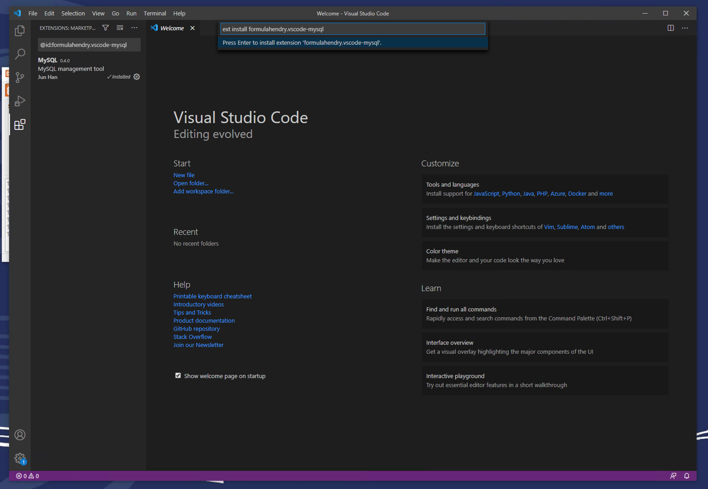
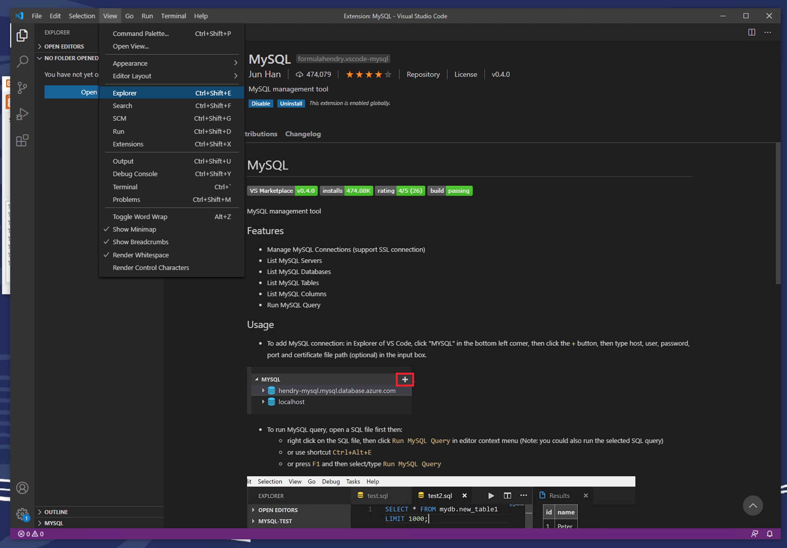
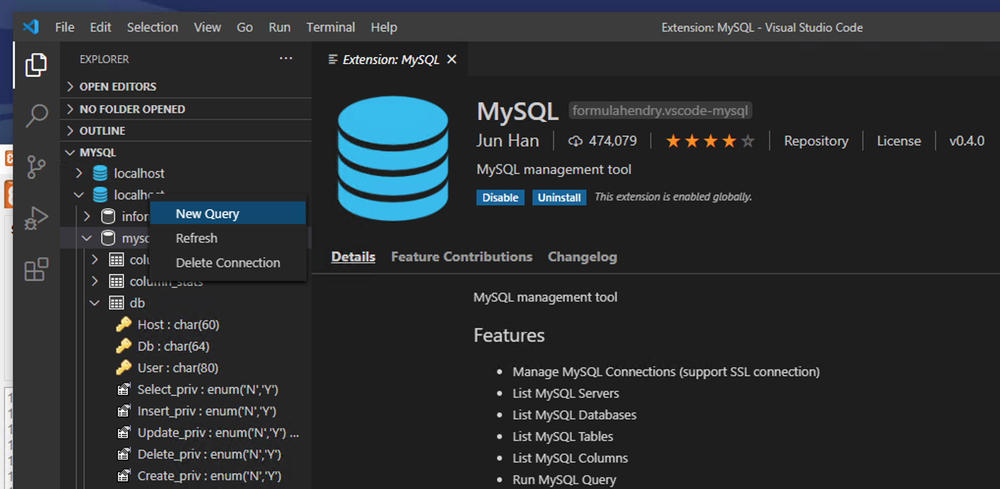
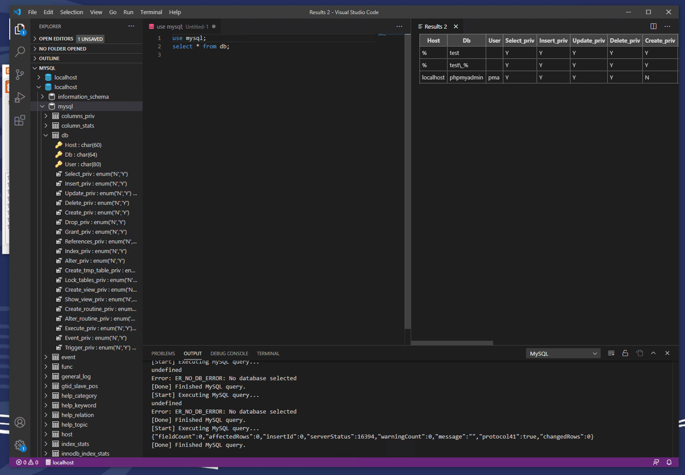

# Setting up your machine for CSCM59

First of all, if you have everything set up and you're happy with it then feel
free to ignore these instructions. 

Based on the first lab session many people are running windows so these
instructions may have windows-specific keystrokes. In VS Code you can find the
equivalent command either in the main menu or by right clicking in the file and
using that menu.

## Installing everything

*If you are having issues from trying to get things working in the previous
lab. My advice is to uninstall everything you installed and start fresh.*

This installation guide is for using [MariaDB](https://mariadb.org/) (the open
source fork of MySQL) and [VS Code](https://code.visualstudio.com/). If you 
run into issues, check the FAQ document on canvas first!

1. Download the version of MariaDB for your OS from <https://mariadb.org/download/>
2. Run the installer. You can accept the defaults. There is a part where it 
   asks for your database password. If you uncheck this box then your root 
   password for the database will be blank.
3. Download the version of VS Code from <https://code.visualstudio.com/>.
4. Run the installer. You can just accept all the defaults.
5. Install the [MySQL vscode](https://marketplace.visualstudio.com/items?itemName=formulahendry.vscode-mysql)
   plugin:
    1. Hit `Ctrl-P` on your keyboard. This will bring up the command dialog. 
    2. Type (or paste) `ext install formulahendry.vscode-mysql` into the dialog
       box.

       
6. Log into the database using vscode:
    1. Go to the 'Explorer' view in vscode. View menu -> explorer

       

    2. Click the down arrow next to MYSQL in the list on the left
    3. Click the plus button next to MYSQL to create a new connection
        * hostname: localhost
        * username: root
        * passowrd: leave blank (just hit return) If you set a password when 
                    installing the database enter it here instead
        * port: 3306
        * just hit return for the certificate question
    4. You should now be able to see a database called 'localhost' in the 
       explorer list on the left.

## How to run queries in general

The [instructions](https://marketplace.visualstudio.com/items?itemName=formulahendry.vscode-mysql)
within the plugin give more information on the features but just as an overview:

1. Click the arrow to the left of the localhost server to expand the list of
   databases.
1. Right click the database you want to use for your queries.

   

2. Choose 'New query'. This will open up a new text file which you can type
   sql in.
3. Push `Ctrl-Alt-E` to execute all SQL in the file. You can also highlight 
   lines and just run those which is great for debugging! If `Ctrl-Alt-E` 
   doesn't work try right clicking the file/selection and choosing run query
   from there.

   
4. Results are shown in the table on the right. Make sure to check the output
   text on the bottom of the screen for any errors!

