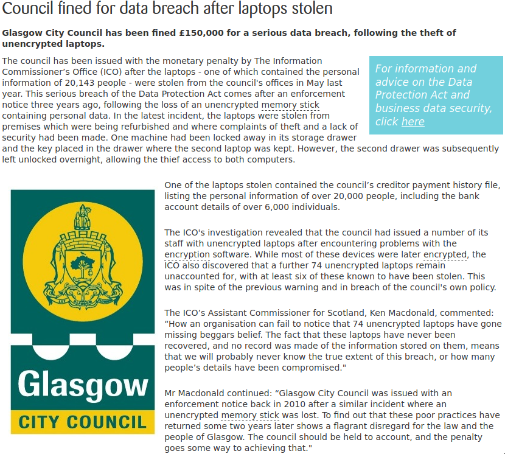
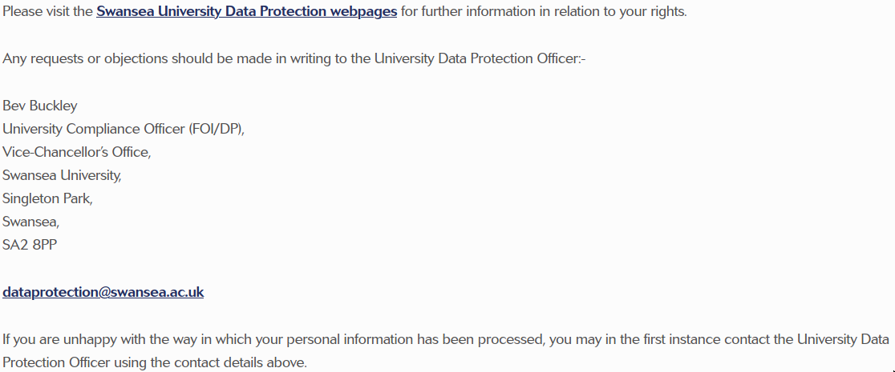
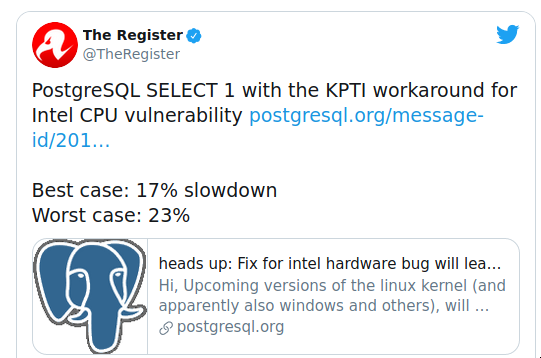
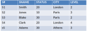

## Introduction

Security is different to Integrity

* **Security** 
    - protecting data from unauthorised users
    - making sure people are allowed to do something
* **Integrity** 
    - protecting data from authorised users
    - making sure the thing someone is trying to do is correct

* **Constraints** are required
    - specified in some suitable language 
    - stored in the system
    - system must monitor operations to ensure constraints are enforced

## Aspects of security

* **Legal, social and ethical**: is the user allowed access?
* **Physical controls**: Is the terminal locked?
* **Policy questions**: who decides who is allowed access?
* **Operational**: if passwords are used how is their integrity enforced?
* **Operating system support**: is main memory erased when no longer needed? What about the recovery log?
* **DBMS**: our main concern

## Legal, social, ethical

Is the user allowed access?

{height="620px"}

## Physical controls

{height="620px"}

## Policy questions

Who decides who is allowed access?

{height="620px"}

## Operational 

if passwords are used how is their integrity enforced?


## OS support




## Two approaches

Discretionary control
: Each user is given rights over certain objects for certain operations

. . .

Mandatory control
: Each user and each object is given a level, and typically cannot access anything above that level
: **Not in MySQL**

## System must be informed

* Since the decision as to ‘who can do what’ is policy, it is outside the DBMS’s control. DBMS can only enforce decisions when they are made.
* Constraints must be declared using an appropriate language, and saved in the catalogue.
* There must be a means of checking requests against constraints.
* The system must be able to recognise the source of a request. 
  (note: a single id may be given to several users)

## Discretionary control

We need a language in which we can express constraints.
NOTE:  It is easier to state what is allowed than to state what is forbidden. Therefore we are expressing authorities, rather than constraints.

Example:
```
	GRANT		<priviledge list>
	ON		<relvar name>
	TO		<user id list>
```

NOTE: "all" can be used as a legal id

more: <https://dev.mysql.com/doc/refman/5.7/en/grant.html>

## Language

```sql
GRANT	 SELECT, DELETE
	ON			S
	TO			Jim, Fred, Mary
```

## Privileges

* SELECT
* INSERT
* DELETE
* UPDATE
* ALL

NOTE: Often queries will touch other unexpected other objects (e.g. views)

One can also grant privileges to create, drop, rename etc, etc. 

## Not authorized?

What happens when authority is not allowed for an enquiry?

Suggestions:
1. Send error message. Careful not to be too explicit!
2. Lock terminal?
3. Terminate program?
4. Keep a log of all requests?...or maybe just refused requests?

## Mandatory control

Each data object has a level.
Each user has a level.

Then
	a) User x can retrieve object y only if level x >= level y. (Simple security property)

	b) User x can update object y only if x = y. (Star property)

Why?

## Implementation

Each tuple must have an extra attribute containing its level.

Anything written by user level x has that value automatically.



## Implementation

User U3 = level 3
User U2 = level 2

Retrieve all from Tablename

U3 sees four tuples.
U2 sees two tuples.

## Request modification

S where city = "London"

Becomes

S where city  = “London” and level <= user level;

Again must be invisible to user.

## Problems?

Looking at the relvar again:

User U3 will be able to see four tuples.
Will be unaware that supplier S4 exists.

So following request seems reasonable:

```sql
Insert into S tuple	{s# = s4,
			Sname = Baker,
			Status = 25,
			City = Rome,
			};
```

## Problems?

This will need to become:

```sql
Insert into S tuple	{s# = s4,
			Sname = Baker,
			Status = 25,
			City = Rome,
			Level = 3
			};
```

Note that implicitly the primary key now is a composite key of S# and level.

Depending upon the user level each of users U1, U2, U3 and U4 will see completely different views of the data.

## Summary

