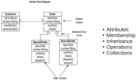
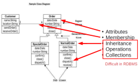

## Object-oriented databases

{height="700px"}

## Object-oriented databases

{height="700px"}

## Why this kind of database?

* **Complex data types**
    * images
    * geographic information
    * CAD drawings
* **Difficult query expressions**
    * e.g. does a particular rectangle overlap another?

## Solutions

* Object-relational mapping (ORM)
* Specialized datatypes (e.g. JSON column type)
* **Object-oriented database** (today)

## Advantage

* A debt tuple
* Many Emp tuples exist, each with a foreign key referencing the primary key attribute of Dept.
* Instead imagine a Dept object which contains lots of Emps, and "knows" how to hire/fire employees, can specialize (subclass) departments

{>> diagram here <<}

## Disadvantages

* Applications (Object-Oriented) are specialised. Databases are general.
* Easy to ask an O-O database "Who works in marketing?"
* Dificult to ask "List departments that employ women"

## Application areas

Good for storing large objects

* Computer-aided design
* Physics
* Bioinformatics
* Defense

## OODB concepts

* In a programming language an object is *transient*
* In a database an object is *persistent*
* can be retrieved, referenced, and used by other programs

## OODB concepts

* Objects in database have state and behaviour
* Objects tend to have arbitrarily complex structure
* Objects will have a system-generated unique identity 
    * Called an **OID**
    * (cf: primary key)
* Relationships between objects are typically implemented by the objects 
  holding references to each other's id

## Object structure

The **state** (current value) of a complex object can be constructed from other objects or values by using **type constructors**

* Let $O = (i, c, v)$ be an object
* $i$ is an OID
* $c$ is a type constructor (how to construct the object)
* $V$ = current state or value

## Example objects

* o1 = (i1, atom, 10M)
* o2 = (i2, atom, Marketing)
* o3 = (i3, atom, Lopez)
* o4 = (i4, atom, Cheng)
* o5 = (i5, set, {o3,o4})
* o6 = (i6, tuple, <Dname:i2, Budget:i1>)

## Object identity (OID)

The link between objects

* Unique
* System-generated
* Usually not visible to external users
* Must be *immutable* (cannot change)
* Only used once for one object. Even if that object is deleted its OID should not be reissued
* More usual to assign a long integer and store OIDs in a hash table

## Object behaviour

* The behaviour of an object is defined by the operations that can be applied to it externally
* The internal structure is hidden (encapsulation) and can only be modified by using methods whose signature is visible externally
* Most operations that update an object’s state are encapsulated. This means that integrity constraints are programmed into the objects methods, rather than predefined in a database schema. (ODMG 2.0 allows some constraints to be specified directly)

## Inheritance

* Typically a type can be named as a subtype of an existing type.
* Subtypes inherit all state and behaviour from (all) their supertypes (can be restricted in supertype) and only define local differences.

## Multiple inheritance

Can cause problems

Some implementations allow multiple inheritance, some do not allow, some force renaming

## Summary

* **RDBMS**: relation is fundamental data type
* **Object-oriented**: object is the fundamental data type
* Objects linked through *OID*s
* Allows for complex, domain-specific queries
* Can handle complex datatypes

