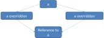

## Object-oriented databases

{height="700px"}

## Object-oriented databases

{height="700px"}

## Why this kind of database?

* **Complex data types**
    * images
    * geographic information
    * CAD drawings
* **Difficult query expressions**
    * does a particular rectangle overlap another?
    * what is the geodesic distance between London and Swansea?

## Solutions

* Object-relational mapping (ORM)
* Specialized datatypes (e.g. JSON column type)
* **Object-oriented database** (OODB) --- today

## Advantage

* **Domain-specific operations**
    * `Dept` object "knows" how to hire/fire
* **Specialization** (subclasses)
    * Special attributes
    * Particular functionality

## Disadvantages

* **Over-specialization**
    * Applications (Object-Oriented) are specialised
    * Data storage should be general
* **Query flexibility**
    * Easy to ask an O-O database "Who works in marketing?"
    * Dificult to ask "List departments that employ women"

## Application areas

Good for storing large objects

* Computer-aided design
* Physics
* Bioinformatics
* Defense

## OODB concepts

* Objects in database have state and behaviour
* Objects tend to have arbitrarily complex structure
* Objects will have a system-generated unique identity 
    * Called an **OID**
    * similar to primary key
* Objects can reference each other

## OODB concepts

* In a programming language an object is *transient*
* In a database an object is *persistent*
* can be retrieved, referenced, and used by other programs

## Object structure

state
: current value of an object

type constructor
: determines object structure

* Let $O = (i, c, v)$ be an object
* $i$ is an OID
* $c$ is a type constructor (how to construct the object)
* $V$ = current state or value

## Basic type constructors

Atom 
: an atomic value from the domain of basic values supported by the system

Set 
: set of OIDs representing objects of the same type

Tuple 
: $<a_1:i_1, a_2:i_2, \ldots, a_n:i_n>$, where each $a_j$ is an attribute name 
  and each $i_j$ is an OID

List 
: similar to set, except that lists are ordered

Array 
: similar to a list but is typically of fixed size

Bag 
: similar to set except that bags can contain duplicates.

## Example objects

* o1 = (i1, atom, 10M)
* o2 = (i2, atom, Marketing)
* o3 = (i3, atom, Lopez)
* o4 = (i4, atom, Cheng)
* o5 = (i5, set, {o3,o4})
* o6 = (i6, tuple, <Dname:i2, Budget:i1>)

## Object identity (OID)

The link between objects

* Unique
* System-generated
* Usually not visible to external users
* Must be *immutable* (cannot change)
* Only used once for one object. (OID never reissued)
* **Method**
    * Assign a long integer 
    * store OIDs in a hash table

## Object behaviour

Encapsulation
: internal structure is hidden
: can only be modified by a public interface

* defined by the operations that can be applied to it externally
* integrity constraints are part of object's methods
* ODMG 2.0 allows some constraints to be directly specified

## Inheritance

* Typically a type can be named as a subtype of an existing type
* Subtypes inherit all state and behaviour from (all) their supertypes
* Subtypes only define local differences

## Multiple inheritance

Can cause problems

* Can cause problems
* **Solutions**
    * allow multiple inheritance
    * not allowed
    * force renaming

## Summary

* **RDBMS**: relation is fundamental data type
* **Object-oriented**: object is the fundamental data type
* Objects linked through *OID*s
* Allows for complex, domain-specific queries
* Can handle complex datatypes

