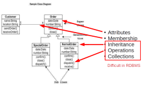
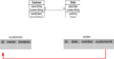
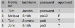
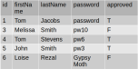
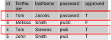
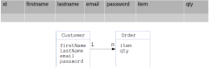
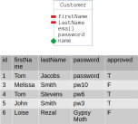

## Object-oriented databases

{height="700px"}

## Solutions

* **Object-relational mapping** (ORM) --- today
* Specialized datatypes (e.g. JSON column type)
* Object-oriented database (OODB) --- last time

## Object-relational mapping (ORM)

* **Object**: defined by application
* **Relational**: relations in RDBMS
* **Mapping**: how attributes and classes map to database tables 
               and attributes

## In brief

{height="400px"}

* Objects mapped to tables
* Class attributes mapped to table columns
* Each class instance is a row
* 'has a' uses primary/foreign key links

## Implementation basics

* Library in target language
* Programmer never reads/writes SQL
* Sometimes can create the tables in DB
* Some can version your database (migrations)

## Implementations

* [Hibernate](https://hibernate.org/orm/) (Java)
* [Active Record](https://rubyonrails.org/) (Ruby)
* [Django](https://www.djangoproject.com/) (Python)
* [Waterline](https://waterlinejs.org/) (Node.js)
* [Slick](http://scala-slick.org/) (Scala)
* [Yesod](https://www.yesodweb.com/) (Haskell)
* and more!

## How it works

1. Define objects in target language
2. Create table for each object you want to store
3. Create mapping from object to tables
    * each object assigned to single table
    * attributes of object mapped to columns in table
    * methods are ignored

## Defining objects/table

::::::::: {.columns}
::: {.column width="45%"}
```java
@Entity(name = "User")
public class User {
  public User(String fn, String ln, String pw) {
    // omitted
  }

  @Id
  private Integer id;
  private String firstName;
  private String lastName;
  private String password;
  private boolean approved

  // Getters and setters omitted
} 
```
:::
::: {.column width="55%"}
{width="100%"}
:::
:::::::::

## Storing objects

::::::::: {.columns}
::: {.column width="45%"}
```java
User u = 
  new User("Loise", "Rezal",  
           "Gypsy Moth");

session.persist(u); 
```
:::
::: {.column width="55%"}
{width="100%"}
:::
:::::::::

## Querying items

::::::::: {.columns}
::: {.column width="45%"}
```java
String hql = "FROM User WHERE firstName = 'Tom'";

Query q = session.createQuery(hql);

// results will be a list of objects
List results = q.list(hql); 
```
:::
::: {.column width="55%"}
{width="100%"}
:::
:::::::::

## Issues

* Inheritance
* Functions/methods
* Existing databases
* Application changes

## Inheritance

::::::::: {.columns}
::: {.column width="45%"}
```java
@Entity(name = "User")
public class User {
  @Id
  protected Integer id;
  protected String firstName;
  protected String lastName;
  protected String password;
  protected boolean approved

  // etc
}

public class AdminUser extends User {
  protected String adminType;
  protected String location;
} 
```
:::
::: {.column width="55%"}
{width="100%"}
:::
:::::::::

## Functions/methods

Where are triggered actions done?

* DB           [Can't manipulate application objects]{style="color: red"}
* Object model [Database no longer universal]{style="color: red"}
* both         [Duplication of code]{style="color: red"}

## Existing databases

* Can't always cleanly map object model onto existing table structure

{height="450px"}

## Application changes

::::::::: {.columns}
::: {.column}
* Easy to change objects
* Expensive to change DB structure
* Migration scripts can help (sometimes)
:::
::: {.column}

:::
:::::::::

## References

* Martin Fowler. 2002. Patterns of Enterprise Application Architecture. 
  Addison-Wesley Longman Publishing Co., Inc., Boston, MA, USA. 
* Ireland, Christopher, David Bowers, Michael Newton, and Kevin Waugh. 
  "A classification of object-relational impedance mismatch." In 2009 First 
  International Confernce on Advances in Databases, Knowledge, and Data 
  Applications, pp. 36-43. IEEE, 2009.

## Summary

* ORM maps between object attributes and relational attributes
* Rarely have to write SQL
* Use database like a file system

