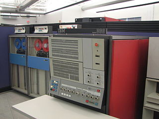
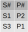

## What is this?

* Database languages are rooted in set theory and logic
* Logic used in queries
* **Helps problem solving**: Different ways to view the same problem 

```sql
SELECT u1.username, u1.email, u1.type, u2.username, u2.email, u2.type
FROM links l, users u1, users u2
WHERE l.link_a = u1.username
  and l.link_b = u2.username
  and ((u1.type = 'pet' and (u2.type = 'person' or u2.type = 'admin'))
      or (u2.type = 'pet' and (u1.type = 'person' or u1.type = 'admin')))
```

## Outline

* Relational algebra
* Relational calculus
* Example




::: notes
Data queries can be specified at various levels of abstraction
:::

## Relational algebra

* **Relational expressions**
    * Define what data to retrieve
* **Operators**
    * Each takes one or more *relations* and returns *relations*
* **Boolean expressions**
    * Used for selecting items

### Example

```
(Department Product Employee) 
WHERE Department.Dept#=Employee.Dept# 
  AND Salary <= 40K
```

## Original operators

* Union
* Difference
* Cartesian product
* Restriction
* Projection

Join, Divide, Intersection, etc can be built from these

## Union

Union
: Given 2 relations $A$ and $B$, $A \text{ Union } B$ contains all tuples
  of both $A$ and $B$ with duplicates removed

. . .

::::::::: {.columns}
::: {.column}
### A

:::
::: {.column}
### B

:::
:::::::::

$A \text{ Union } B$


## Difference

Difference
: Given 2 relations $A$ and $B$, $A \text{ Minus } B$ contains all tuples
  of $A$ but not in $B$

. . .

::::::::: {.columns}
::: {.column}
### A

:::
::: {.column}
### B

:::
:::::::::

$A \text{ Minus } B$


## Cartesian product

Cartesian product
: Given 2 relations $A$ and $B$, $A \text{ Product } B$ contains all combinations
  of each tuple of $A$ with each tuple of $B$

. . .

::::::::: {.columns}
::: {.column}
### A

:::
::: {.column}
### B

:::
:::::::::

$A \text{ Product } B$


## Restriction

Restriction
: Given a relation $A$, $A \text{ where } P$ returns a subset of $A$ containing
  tuples, $t$, where $P(t)$ is true.

. . .

### A


$A \text{ where S#} = 1$


## Projection

Projection
: Given a relation $A$, $A\{g,e\}$ returns a relation containing only 
  attributes $g$ and $e$ from $A$.

. . .

### A


$A\{\text{S#}, \text{Status}\}$


## The others

* **Intersection**

  $A \text{ Intersect } B = (A \text{ Union } B) \text{ Minus } (A \text{ Minus } B) \text{ Minus } (B \text{ Minus } A)$

* **Natural join**

  $A \text{ Join } B = A \text{ Product } B \text{ where } A.\text{S#} = B.\text{S#}$

## Outline

* Relational algebra
* Relational calculus
* Examples


## Relational calculus

* Based in set theory
* Full power of mathematics is available to you!

## Relational calculus

Queries are in the form of:

$\{t | P(t) \}$

* $t$ is a *magic* tuple
* $P(t)$ is a predicate function
* Result is the set of all tuples, $t$ where $P(t)$ returns true

## The magic $t$

What is 
$\{t | P(t) = true\}$?

. . .

::::::::: {.columns}
::: {.column}
### A

:::
::: {.column}
### B

:::
:::::::::

$\{t | P(t) = true\}$? is


## Tuple relation calculus

* $u.A$ or $u[A]$: attribute $A$ of tuple $u$
* $u \in R$: denotes $u$ is a tuple of relation $R$
* $P(t)$ is a predicte function working on tuples $t$ (if true, item is in set)

## "Joins"

Using quantifiers

* **Forall ($\forall$)**
    * $\forall u \in R, P(u)$ means for all tuples in u $P(u)$ must hold true
    * Useful for constraints
* **Exists ($\exists$)**
    * $\exists u \in R, P(u)$ means there is at least one tuple in R for which $P(u)$ is true
    * This introduces relations you can use for joins

. . .

### Example

::::::::: {.columns}
::: {.column}
#### Relational algebra
```
A JOIN B
```
:::
::: {.column}
#### Relational calculus
$\{t | \exists a \in A, \exists b \in B, a.id=b.id\}$
:::
:::::::::

## Full example

What are the names of the suppliers that supply part number P2?

::::::::: {.columns}
::: {.column}
### S table

:::
::: {.column}
### SP table

:::
:::::::::

. . .

::::::::: {.columns}
::: {.column width="33%"}
### SQL
```sql
SELECT S.Sname
FROM S, SP
WHERE S.`S#`=SP.`S#`
  and SP.`P#`='P2'
```
:::
::: {.column width="33%"}
### Relational algebra

((SP join S) where p# = ‘P2’){Sname}
:::
::: {.column width="33%"}
### Relational calculus

$\{t.\text{Sname} | \exists s \in S, \exists p \in SP, s.\text{s#} = p.\text{s#} and p.\text{P#} = P2\}$
:::
:::::::::

## Summary

* **relational algebra**: kind of an abstract version of SQL
* **relational calculus**: set theory
* Need to practice this!

