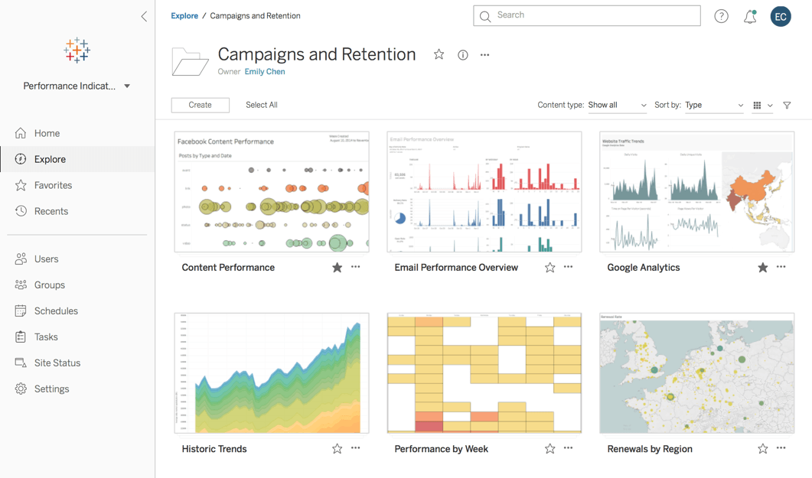
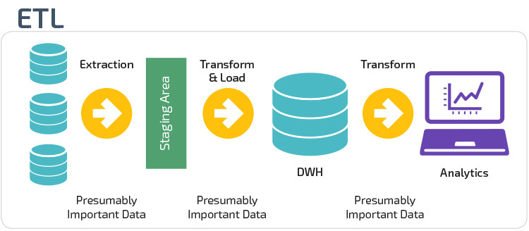
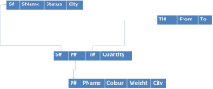
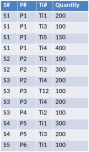
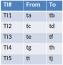
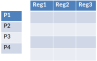
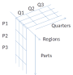

## Decision support

::::::::: {.columns}
::: {.column}
* **Decision support systems** 
    * help in the analysis of business information
    * spot trends
    * pinpoint problems 
    * make intelligent decisions
:::
::: {.column}

:::
:::::::::

These days – analytics engines

## Business queries

What if...?

If a customer buys soap, will he also buy toothpaste?

...within x days...

## General aspects

* Primarily read-only
* Columns tend to be used in combination
* Keys often include a temporal component
* Databases tend to be large
* Heavily indexed



## Example

```sql
select p.display_name as loan_officer, o.display_name as branch, d.month_name, 
       sum(disbursal_count) as disbursals,
       sum(disbursal_amount) as disbursal_amount
from fact_loan_disbursals disb
join dim_date d on d.date_key = disb.disbursal_date_key
join dim_office o on o.office_key = disb.branch_key
join dim_personnel p on p.personnel_key = disb.loan_officer_key
where d.year4 = 2009
  and p.is_loan_officer is true
  and o.assets < (select avg(assets) from dim_office where country='UK')
group by p.display_name, o.display_name, d.month_number
order by p.display_name, o.display_name, d.month_number
```

## Boolean expression complexity

* Complicated expressions in where clause
* Hard to write
* Hard to understand

``` {.sql data-line-numbers="|8-10"}
select p.display_name as loan_officer, o.display_name as branch, d.month_name, 
       sum(disbursal_count) as disbursals,
       sum(disbursal_amount) as disbursal_amount
from fact_loan_disbursals disb
join dim_date d on d.date_key = disb.disbursal_date_key
join dim_office o on o.office_key = disb.branch_key
join dim_personnel p on p.personnel_key = disb.loan_officer_key
where d.year4 = 2009
  and p.is_loan_officer is true
  and o.assets < (select avg(assets) from dim_office where country='UK')
group by p.display_name, o.display_name, d.month_number
order by p.display_name, o.display_name, d.month_number
```

## Join complexity

* fully normalised queries involve joins over several tables
* Designers often "denormalise" tables

``` {.sql data-line-numbers="|4-7"}
select p.display_name as loan_officer, o.display_name as branch, d.month_name, 
       sum(disbursal_count) as disbursals,
       sum(disbursal_amount) as disbursal_amount
from fact_loan_disbursals disb
join dim_date d on d.date_key = disb.disbursal_date_key
join dim_office o on o.office_key = disb.branch_key
join dim_personnel p on p.personnel_key = disb.loan_officer_key
where d.year4 = 2009
  and p.is_loan_officer is true
  and o.assets < (select avg(assets) from dim_office where country='UK')
group by p.display_name, o.display_name, d.month_number
order by p.display_name, o.display_name, d.month_number
```

## Functional complexity

* Queries involve statistics
* Traditional SQL implementations slow to provide support 
    * queries broken down into several queries 
    * statistical analysis carried out separately

``` {.sql data-line-numbers="|2-3,11"}
select p.display_name as loan_officer, o.display_name as branch, d.month_name, 
       sum(disbursal_count) as disbursals,
       sum(disbursal_amount) as disbursal_amount
from fact_loan_disbursals disb
join dim_date d on d.date_key = disb.disbursal_date_key
join dim_office o on o.office_key = disb.branch_key
join dim_personnel p on p.personnel_key = disb.loan_officer_key
where d.year4 = 2009
  and p.is_loan_officer is true
  and o.assets < (select avg(assets) from dim_office where country='UK')
group by p.display_name, o.display_name, d.month_number
order by p.display_name, o.display_name, d.month_number
```

## Analytical complexity

* queries involve several "sub-queries" 
* can be prevented by SQL implementations

``` {.sql data-line-numbers="|10"}
select p.display_name as loan_officer, o.display_name as branch, d.month_name, 
       sum(disbursal_count) as disbursals,
       sum(disbursal_amount) as disbursal_amount
from fact_loan_disbursals disb
join dim_date d on d.date_key = disb.disbursal_date_key
join dim_office o on o.office_key = disb.branch_key
join dim_personnel p on p.personnel_key = disb.loan_officer_key
where d.year4 = 2009
  and p.is_loan_officer is true
  and o.assets < (select avg(assets) from dim_office where country='UK')
group by p.display_name, o.display_name, d.month_number
order by p.display_name, o.display_name, d.month_number
```

## Efficiencies

* Inserts/updates rare
* **Normalization not so important**
    * copy data to many locations
    * "pre-join" tables at physical level
* Materialize views

## Data warehouses

* very large special databases
* collected by querying several separate databases 
* stored in a separate location
* querying doesn't impact normal workplace databases


## Large databases

* Can be several terabytes in size
* Performance tuning can be hard (growing by up to 50% per year)
* **Scalability a problem**
    * Database design ("unnormalised")
    * Inefficient use of relational operations
    * Weaknesses in DBMS implementations
    * Lack of scalability in DBMSs
    * Architectural design errors

## Dimensional schemas

* Design for efficiency of queries
* **Two types of table**
    * Dimensional tables
    * Fact table

Dimensional table
: Stores information about entities
: Primary keys for fact tables

Fact table
: Stores data about measures relating to entities
: Often timeseries data

## Dimensional schemas

* Called **star schemas** due to entity relationship diagram
* **Two types of table**
    * Dimensional tables
    * Fact table



## Example

::::::::: {.columns}
::: {.column}
### Dimensional table

:::
::: {.column}
### Fact table

:::
::::::::: 

## Multi-Dimensional schemas

All data so far has been seen as 2-dimensional



## Multi-Dimensional schemas

* Data viewed as a cube (or hypercube)
* Each cell contains summary stats for that set of criteria



## Pivoting

By "pivoting" a (hyper)cube around an axis we get a different interpretation


## Summary

* Fully normalized schemas are slow for complex queries
* Specialized schemas to support analytic tasks
    * Star schema
    * Multi-dimensional schema
* Analytics database populated from general-purpose databases

