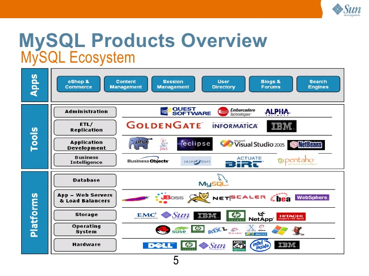
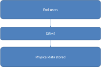
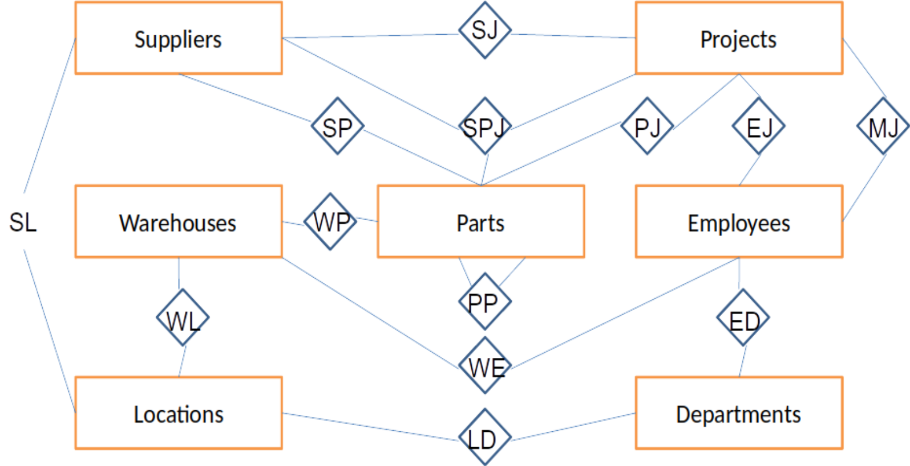

##

## Database system

* A computerised record-keeping system. 
* Consists of the data, hardware, software (DBMS), and users.
* Users = programmers, end-users, Database Administrator (DBA). 
* DBA is responsible for administering the database according to instructions given by the Data Administrator (DA).
* Databases are integrated, and shared (usually). 
* Store persistent data = entities + relationships.
* Transactions.
* Data independence.
* Each row is  a true proposition from which other true propositions may be inferred.

## What do we want to do with data?

* Add files
* Remove files
* Add data
* Retrieve data
* Alter data
* Remove data

## Integrated

A collection of separate files with redundancy removed (as far as possible).

## Shared

* Several different users, each with different requirements and interests.

* Each user sharing the database sees a subset of the data.

* Each user has a different view of the database.

* Sometimes, different users view different data simultaneously (concurrency).

## Software

{height=600px}

## Users

* Application programmers

* Users

* DBA

## Entity relationship diagram

{height=600px}

## Entity relationship

* Relationship is a part of the data!!!!!

* Not all relationships binary.

### Example

A.Smith supplies monkey wrenches to Manhattan project

B. Smith supplies monkey wrenches.
C. Monkey wrenches are used in the Manhattan project.
D. The Manhattan project is supplied by Smith.

B + C + D ¬=> A

## Database advantages

* Data is shared
* Redundancy reduced
* Avoid inconsistency (sort of)
* Supports transitions
* Maintains integrity
* Enforce security
* Enforce standards

## Database models

* **Relational**
* Inverted list
* Hierarchic
* Network
* **Object**

