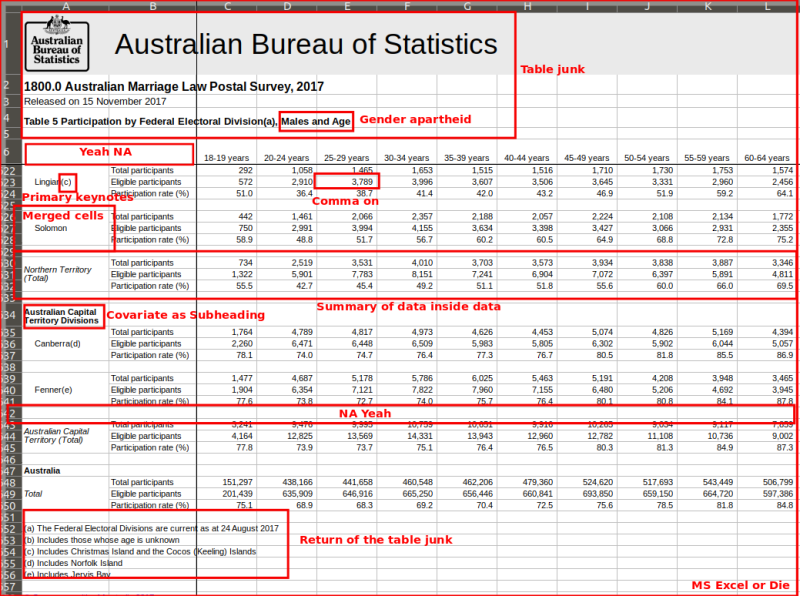
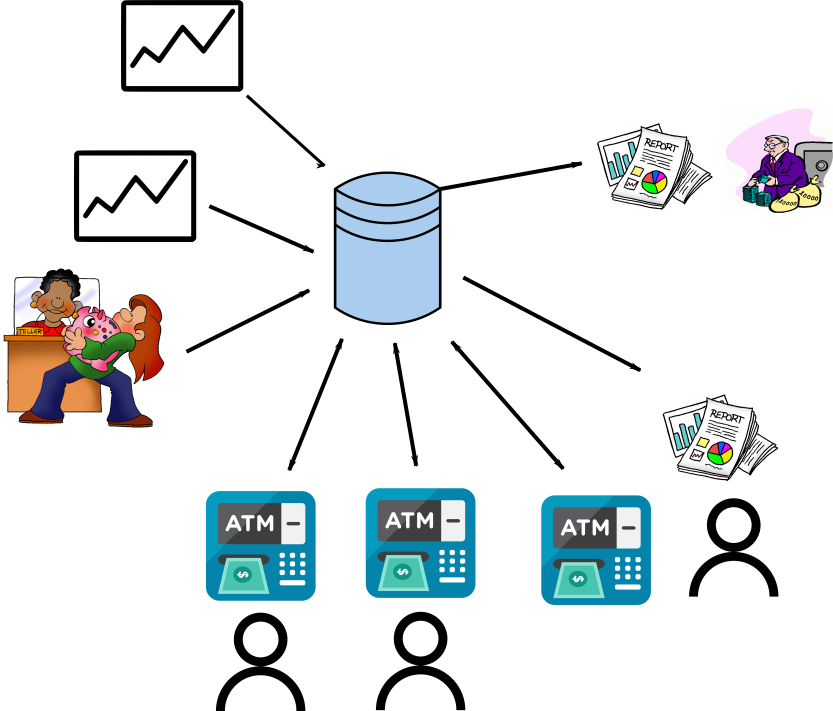
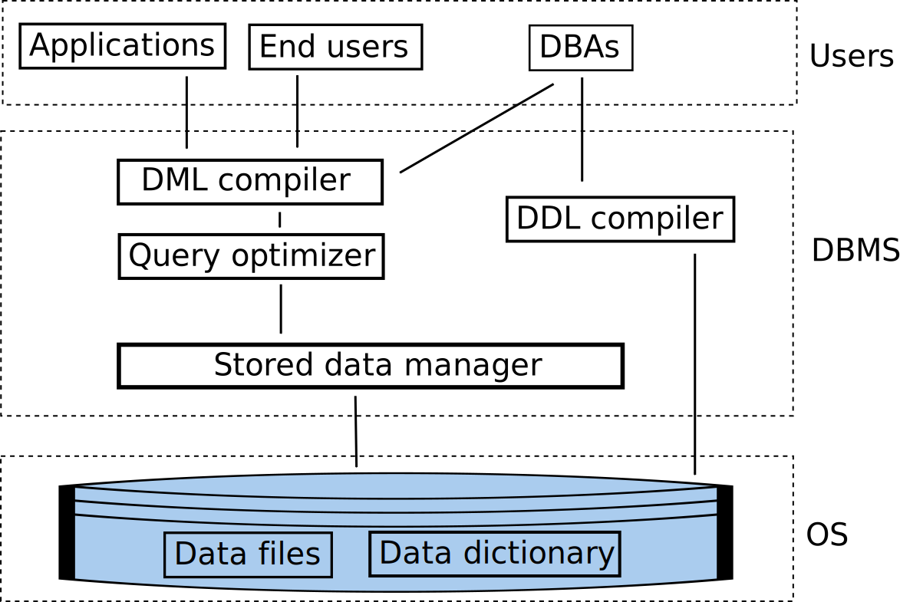

## What do we want to do with data?

::::::::: {.columns}
::: {.column}

* Add files
* Remove files
* Add data
* Retrieve data
* Alter data
* Remove data

:::
::: {.column}

:::
:::::::::

## Database system

::::::::: {.columns}
::: {.column width="70%"}

* **What is it?**
    * A computerised record-keeping system. 
    * Consists of the data, hardware, software (DBMS), and users.
    * Centralizes source of data in an organization
* **Concepts**
    * Databases are integrated, and shared (usually). 
    * Store persistent data = entities + relationships.
    * Transactions.
    * Data independence.
    * Each row is a true proposition from which other true propositions may be inferred.

:::
::: {.column width="30%"}
)](images/brazil.jpeg)
:::
:::::::::

## Database advantages

::::::::: {.columns}
::: {.column}

* Data is shared
* Redundancy reduced
* Avoid inconsistency (sort of)
* Supports transitions
* Maintains integrity
* Enforce security
* Enforce standards

:::
::: {.column}

:::
:::::::::

##

{height=780px}

## Integrated

Integrated
  : A collection of separate files with redundancy removed (as far as possible)

## Shared

Shared
  : The ability to share the same data resource with multiple applications or users

* Several different users, each with different requirements and interests.
* Each user sharing the database sees a subset of the data.
* Each user has a different view of the database.
* Sometimes, different users view different data simultaneously (concurrency).

## Software

{height=600px}

## Software

::::::::: {.columns}

::: {.column width=60%}

:::

::: {.column width=40%}

Data manipulation language
  : (DML) Language used for retrieving and changing data

Data definition language
  : (DDL) Language used for defining the data schema

SQL can do both of these

:::

:::::::::

## Users

* **Application programmers**
    - Write software front-ends to the database

* **Users**
    - Directly write queries to the database
    - Run reporting engines

* **DBA**
    - responsible for administering the database according to instructions given by the Data Administrator (DA).

## Entity relationship diagram

{height=600px}

::: notes

* Relationship is a part of the data!!!!!
* Not all relationships binary.

### Example

A.Smith supplies monkey wrenches to Manhattan project

B. Smith supplies monkey wrenches.

C. Monkey wrenches are used in the Manhattan project.

D. The Manhattan project is supplied by Smith.

$B + C + D \nRightarrow A$

:::

## Database models

* **Relational**
* Inverted list
* Hierarchic
* Network
* **Object**
* **Document-oriented**

## Summary

* Databases are everywhere
* Databases are integrated and shared in an organization
* ER diagrams are how we can conceptually talk about data
* Not just relational databases

