## What is the structure of data?

> * Text? (unstructured)
> * Tables?
> * Networks?
> * Objects?
> * Records?
> * What else?

::: notes

It turns out people in the 60s were trying to figure this out!

:::

## Relational

{>> put in stuff about history of relational <<}

## Structural

* **Department**

    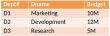

* **Employee**

    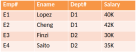

## Why relational

* Relation is just a mathematical term meaning table. The departments-Employees database contains two relations.

* The Relational Model is an abstract theory of data based on sound mathematics mainly set theory and predicate logic).

E. F. Codd, A Relational Model of Data for Large, Shared Databanks, CACM13, No 6, June 1970.

::::::::: {.columns}

::: {.column}

:::

::: {.column}

:::

:::::::::

## Aspects of relational model

* **Structural** 
    - The data is perceived by the user as tables, and nothing but tables.
* **Manipulation** 
     - A set of operators available to the user to allow him to manipulate the tables.
* **Integrity** 
     - These tables satisfy integrity constraints.

## Manipulation

Three fundamental operators

1. Restrict
2. Project
3. Join

## Restrict

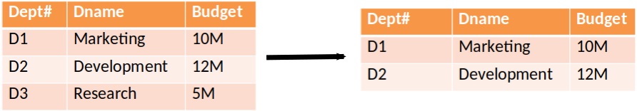

## Project

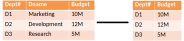

## Join

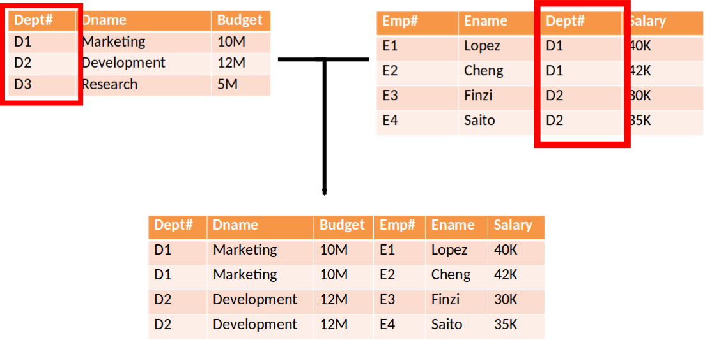

## Relational expressions

Output from each expression is a table

## Relational expressions

Output from one expression can form input to another

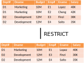

## Relational expressions

* Output from each expression is a table
* Output from one expression can form input to another
* Relational expressions can be nested
    - i.e. operands can be relational expressions

## Optimisation

* Creating tables is expensive
* Tables not necessarily realised.
* For performance reasons try not to realise result.

. . .

Materialised Evaluation
  : {>> need definition <<}

. . .

Pipelined Evaluation
  : {>> need definition <<}

## Optimisation

* Relational languages are **declarative** languages
* The query optimizer is vital!

## Two types of languages

::::::::: {.columns}

::: {.column}
* **Procedural**
    - Series of steps
    - Interpreter
    - Need to ensure steps produce result
:::

::: {.column}
* **Declarative**
    - Describe what you want
    - Interpreter figures out the steps
    - Optimiser is very important!
    - Less code $\approx$ more productive
:::

:::::::::

## Two types of languages

{height=150px}

::::::::: {.columns}

::: {.column}
* **Procedural**
    1. Cook beef patty
    2. Toast buns
    3. Put cheese on patty
    4. Take patty off pan and place on bottom bun
    5. Put top bun on patty/cheese combo
:::

::: {.column}
* **Declarative**
    - Cooked meat
    - Melted cheese
    - Toasted buns
    - Patty on bottom bun
    - Cheese on patty
    - Top bun on top
:::

:::::::::

## Optimisation

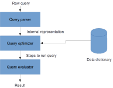

## Optimisation

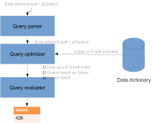

## Integrity

How to ensure data is well-formed?

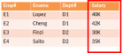

Data types enforce proper format (e.g. integer)

## Integrity

How to ensure data is well-formed?

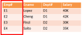

**Primary keys** enforce unique identifiers

{>> need definition of primary key <<}

## Integrity

How to ensure data is well-formed?

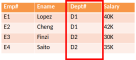

**Foreign keys** enforce values exist in other tables

{>> need definition of foreign key <<}

## The catalogue

* Database systems must keep details of tables, columns, rows, etc
* In relational systems the catalogue itself is a *relational variable*

* **Table**

    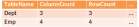

* **Column**

    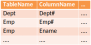

## Interrogating catalogue

What columns does relation variable contain?
`(Column where TableName = ‘Dept’){Column}`

Which relation variables contain a column called Emp#?
`(Column where ColumnName = ‘Emp#’){TableName}`

## Relational variables (RVs)

Base RV 
  : A relation that actually exists
  : e.g.  `Create table Emp()`

Derived RV (View) 
  : The value returned by a Relational Expression 
  : e.g.  `(Create view TopEmp where salary > ’33K’){Emp#, EName, Salary}`

{>> below should be grouped into derived RV <<}

**NOTE**: View is not actually carried out, just stored in the catalogue and
evaluated in actual time. If the original data is altered then the view will
reflect that change.

Transparent to viewer. Can carry out operations on views just as on tables. Data in view altered is reflected in original data.

View is a window into a specified portion of a relation.

## Summary

{>> fill in <<}

