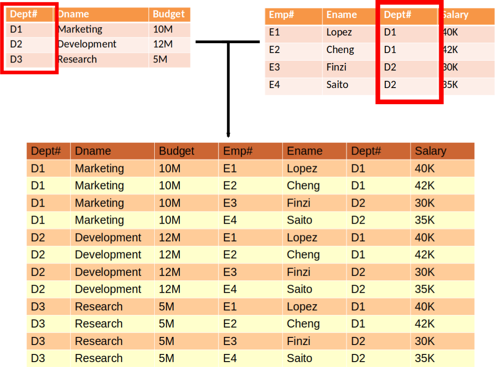

## Practical relational model

* There are a number of query languages developed over the years
* **alpha** (1971) [@Codd:1971]

    ```
    GET W (P.P#,P.PNAME,P.QOH):(P.QOH<25) UP P.WEIGHT 
                                          DOWN P .QOH
    ```

* **Square** (1975) [@Boyce:1975]

    

* **QUEL** (1976) [@Stonebraker:1976]
    
    ```
    range of E is EMPLOYEE
    retrieve into W
    (COMP = E.Salary / (E.Age - 18))
    where E.Name = "Jones"
    ```

::: notes
square is using superscripts rather than dots and equals, etc
:::

## What is SQL

* Practical implementation of the relational algebra
* Developed at IBM in the 70s
* Became standard language for relational databases in 80s
* Each DBMS implements slightly different extensions (boo)

## Features

* Designed to be close to natural english
* **Data manipulation language**
    - Query data
    - Insert/modify/remove data
* **Data definition language**
    - Create/modify tables
    - Define triggers
    - Create constraints

## Data manipulation

* Requesting data
* Inserting data
* Deleting data
* Changing data

## Data definition

* Creating tables
* Deleting tables
* Changing tables

::: notes
we'll talk about these later
:::

## Data types

see https://dev.mysql.com/doc/refman/8.0/en/data-types.html for more

* **BOOLEAN**: true/false
* **INTEGER**: integers
* **DECIMAL**: exact fixed point number --- good for money
* **DOUBLE**: 64 bit floating point numbers
* **DATE**: a date
* **DATETIME**: a date plus time --- good for creation/modification times
* **CHAR(n)**: fixed length character string
* **VARCHAR(n)**: variable length character string
* **TEXT**: strings of text
* **BLOB**: binary storage

## Select statement anatomy

```sql
SELECT <column list>
FROM <table list>
WHERE <condition>
ORDER BY <column list>;
```

* only `SELECT`, `FROM`, and `;` are required
* whitespace not significant
* capitalization (usually) not significant
    - except certain versions of MySQL
* semicolon ends statement

## Requesting data

The SELECT statement!

```sql
SELECT *
FROM <table name>;
```

Example

```sql
SELECT *
FROM Department;
```

## Projection

```sql
SELECT <column1>, <column2>, ..., <columnN>
FROM <table name>;
```

Example

```sql
SELECT ???
FROM Department;
```

## Restriction

```sql
SELECT <column1>, <column2>, ..., <columnN>
FROM <table name>
WHERE <condition>;
```

* **Condition**: boolean expression for which rows to include
* **Made of**
    - column names from referenced tables
    - literals: numbers (1.0), strings ('foo'), etc
    - operators: `=`, `<>`, `>`, `>=`, `<`, `<=`
    - combining terms: `AND`, `OR`
    - missing values: `IS NULL`, `IS NOT NULL`
    - within a subquery: `IN`, `NOT IN`

::: notes
Talk about subqueries in a later lecture
:::

## Restriction

Examples

```sql
SELECT ???
FROM Department
WHERE Budget > 15000000;
```

```sql
SELECT *
FROM Employee
WHERE Ename = 'Lopez';
```

## Ordering output

Not in relational calulus but very useful!

```sql
SELECT ???
FROM <table name>
ORDER BY <column1> <direction>, <column2> <direction>;
```

* **`direction`**: `ASC` or `DESC`

```sql
SELECT ???
FROM Department
ORDER BY Budget DESC;
```

## Join

```sql
SELECT <columns>
FROM <table1>, <table2>, ..., <tableN>
WHERE <condition>;
```

**Not** the same as JOIN in the relational model!

::::::::: {.columns}
::: {.column}

* **Relational model**: JOIN is the 'natural join'
:::
::: {.column}

> * **SQL**: JOIN is the cartesian product of the tables

:::
:::::::::

. . .

Natural join
  : Combine several tables, keeping rows with matching common columns
  : *95% of the time you want this*

. . .

Cartesian product
  : All possible combinations of the rows of 2 tables
  : *$\approx 0$% of the time you want this*

## Natural join

Natural join
  : Combine several tables, keeping rows with matching common columns
  : *95% of the time you want this*

{height=450px}

## Cartesian product

Cartesian product
  : All possible combinations of the rows of 2 tables
  : *$\approx 0$% of the time you want this*

{height=590px}

## Back to JOIN

```sql
SELECT <column list>
FROM <table 1>, <table 2>, ..., <table N>
WHERE <condition>;
```

Example

```sql
SELECT *
FROM Department, Employee
WHERE Department.did=Employee.did
```

## Aliasing tables

* It can be annoying to have to type a long table name over and over again
* What if you want to specify a table more than once?
* You can alias tables in the JOIN clause: `<table name> AS <alias>`
* Be careful about using keywords!


```sql
SELECT d.dname, e.salary
FROM Department as d, Employee as e
WHERE d.did=e.did;
```

## JOIN with restrict

```sql
SELECT *
FROM Department d, Employee e
WHERE d.did=e.did
  and e.salary > 30000;
```

## Summary

* SQL is a practical implementation of the relational model
    - Data manipulation language
    - Data definition language
* SQL and the relational model are not 100% the same
* `SELECT` is likely most common query

## References

