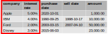
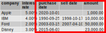
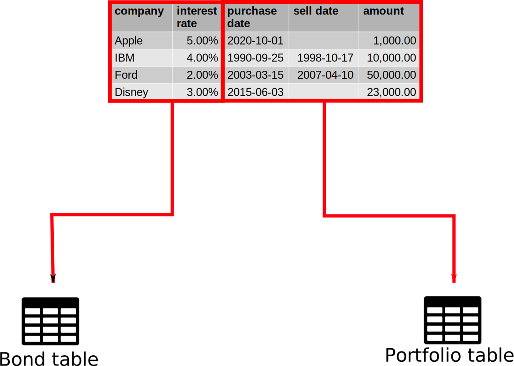

<section data-background-image="images/feedback_howto.png">
</section>

## Overview

* Practical normalization
* Creating tables
* Modifying tables
* Getting rid of everything

## Practical normalization

{height=500px}

## Creating a database

```sql
CREATE DATABASE bond_trader;
```

## Practical normalization

split table into entities

* **Bond**

    {height=200px}

* **Portfolio**

    {height=200px}

## Creating tables

```sql
CREATE TABLE <table name> (
  <column name> <data type> <constraints>,
  <column name> <data type> <constraints>,
  ...
  <column name> <data type> <constraints>,
  PRIMARY KEY (<column name>),
  FOREIGN KEY (<column name>) REFERENCES <foreign table>(<foreign col>)
);
```

Foreign keys **must** be the exact same column type!

## Data types

see https://dev.mysql.com/doc/refman/8.0/en/data-types.html for more

* **SERIAL**: auto-incrementing integers (good for primary keys)
* **BOOLEAN**: true/false
* **INTEGER**: integers
* **DECIMAL(x,y)**: exact fixed point number 
    - good for money
    - x is total number of digits, y is number of digits after decimal point
* **DOUBLE**: 64 bit floating point numbers
* **DATE**: a date
* **DATETIME**: a date plus time --- good for creation/modification times
* **CHAR(n)**: fixed length character string
* **VARCHAR(n)**: variable length character string
* **TEXT**: strings of text
* **BLOB**: binary storage

## Constraints

* **NOT NULL**: not empty --- note: empty string is considered not empty!
* **UNIQUE**: all values must be unique
* **AUTO_INCREMENT**: default value is next highest integer
* **DEFAULT**: default value if none specified
* **PRIMARY KEY**: combines not null and unique
* **FOREIGN KEY**: forces column to contain values in linked table

* **Notes**
    - Foreign keys **must** be the exact same column type!
    - `SERIAL` column type must be `BIGINT(20) UNSIGNED` for foreign 
      keys to work

## Bond table

{height=300px}

```sql
CREATE TABLE bonds (
  bond_id SERIAL,
  company TEXT NOT NULL,
  interest_rate DOUBLE NOT NULL,
  PRIMARY KEY (bond_id)
);
```

## Portfolio table

{height=300px}

```sql
CREATE TABLE portfolio (
  entry_id SERIAL,
  bond_id BIGINT(20) UNSIGNED NOT NULL,
  purchase_date DATE NOT NULL,
  sell_date DATE,
  amount DECIMAL(10,2) NOT NULL,
  PRIMARY KEY (entry_id),
  FOREIGN KEY (bond_id) REFERENCES bonds(bond_id)
);
```

## Inserting the data

{height=500px}

## Inserting the data

{height=300px}

::::::::: {.columns}
::: {.column}
**Bond**

```sql
INSERT INTO bonds (company, interest_rate)
SELECT DISTINCT company, `interest rate`
FROM staging_tbl;
```
:::
::: {.column}
**Portfolio**

```sql
INSERT INTO portfolio (bond_id, purchase_date, sell_date, amount)
SELECT b.bond_id, s.`purchase date`, s.`sell date`, s.amount
FROM bonds b, staging_tbl s
WHERE b.company=s.company;
```
:::
:::::::::

## Modifying tables

May cause database to do a bunch of internal checks

* **Adding columns**

    ```sql
    ALTER TABLE <table name>
      ADD <column name> <data type> <constraints>;
    ```
* **Removing columns**

    ```sql
    ALTER TABLE <table name>
      DROP COLUMN <column name>;
    ```

## Deleting things

May cause database to do a bunch of internal checks

* **Tables**

    ```sql
    DROP TABLE <table name>;
    ```

* **Databases**

    ```sql
    DROP DATABASE <database name>;
    ```

## Summary

* Make sure data types match what you want to store
* Staging tables are great for getting un-normalized 
  data into a normalized database
* Modifying/deleting tables may freeze the database

