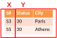
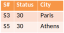
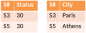
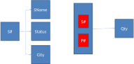
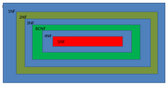
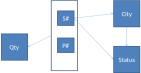
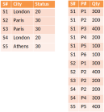
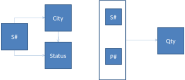
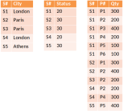
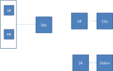

<section data-background-image="images/feedback_howto.png">
</section>

## Overview

* **Overall approach**
* **Normalization**
    - theory
    - guidelines
* **Functional dependency diagrams**
* **Normal forms**

## First steps

1. What elements you want to store in your database? - tables/relations
2. What attributes does each element have? - columns
3. Determine how relations relate to each other – foreign keys
4. Normalize

**Example**

* Suppliers
* Parts
* What parts supplier makes
* Quantities
* Supplier city
* Supplier status code

## First try

::::::::: {.columns}
::: {.column}
* Suppliers
* Parts
* What parts supplier makes
* Quantities
* Supplier city
* Supplier status code
:::
::: {.column}

:::
:::::::::

## Normalization

::::::::: {.columns}
::: {.column}

:::
::: {.column}
* Eliminates redundancies
* makes database more robust to changes
:::
:::::::::

## Database Normalisation

* Normalisation is non-loss 
* Always possible to reverse procedure to recapture the original data.
* Normalisation is a series of `Projects`.
* To reverse the process `join` the resulting projections

::::::::: {.columns}
::: {.column}
* **Before**

    {height=400px} 
:::
::: {.column}
* **After**

    
:::
:::::::::

## Database Normalisation

Relation
  : $R \{A, B, C\}$ denotes a relation called $R$ with attributes $A$, $B$, 
    and $C$

* **Key concepts**
    - Functional depdendencies
    - Left-irreducability
    - Heath's theorem

## Functional Dependencies

How do we tell if we can reconstruct the information?

Functional dependency
  : given a specific $X$ value we can discover $Y$'s value
  : For two given subsets of the attributes of a relation $X$ and $Y$,
    $X \Rightarrow Y$ means $Y$ is functionally dependent upon $X$.

{width=400px}

## Left Irreducibiliy

Irreducibily dependent
  : When $X \Rightarrow Y$, $Y$ is irreducibly dependent upon $X$ if $X$ is 
    as small a subset as possible.
  : i.e. make your primary key a single column if possible


::::::::: {.columns}
::: {.column}
* **Example**
    - {S#, P#} -> City     not left irreducible
    - {S#} -> City             left-irreducible
:::
::: {.column}

:::
:::::::::

## Heath's Theorem

Normalization doesn't loose information

Heath's theorem
  : * Let $R\{A, B, C\}$ be a relvar where $A$, $B$ and $C$ are sets of attributes.
  : * If $R$ satisfies the functional depdency $A \Rightarrow B$ then $R$ is 
      equal to the join of its projections on $\{A, B\}$ and $\{A, C\}$

Meaning: We can split R into 2 relations one containing $\{A,B\}$ and one $\{A,C\}$
and use `JOIN` to recover the original table.

## Two example decompositions

{width=400px}

. . .

::::::::: {.columns}
::: {.column}
* **Information lost**

    {width=400px}

    decomposed into {S#, Status} and {Status, City}
:::
::: {.column}
* **No information lost**

    {width=400px}

    decomposed into {S#, Status} and {S#, City}
:::
:::::::::

::: notes
A = S#, B = Status, C= City
:::

## Normalization

* The decomposition of $R$ into $R_1, R_2, R_3,\ldots,R_n$ is non-loss if $R$ 
  is equal to the join of $R_1,\ldots,R_n$.
* We likely want to impose the condition that all of $R_1,\ldots,R_n$ are 
  necessary.
* E.g., we wouldn't want to decompose S into {S#}, {S#, Status} and {S# , City}.
    - {S#} relation is an unnecessary table

## Overview

* ~~**Overall approach**~~
* ~~**Normalization**~~
    - theory
    - guidelines
* **Functional dependency diagrams**
* **Normal forms**

## Functional Dependency Diagrams

Graphical depiction of functional dependencies

::::::::: {.columns}
::: {.column width="35%"}

:::
::: {.column width="65%"}
{height=700px}
::: 
:::::::::

## Normal forms

* Categories of normalization
* Based on treatment of non-key attributes

{height=700px}

## 1st Normal Form

1st normal form
  : A relvar is in 1NF if and only if every legal value of that relvar contains exactly one value.

::::::::: {.columns}
::: {.column}
Bad


:::
::: {.column}
Good


:::
:::::::::

## 1st normal form

```
FIRST{S#, Status, City, P#, Qty}
	Primary Key{S#, P#}
	Constraint City -> Status
```


## 1st normal form

::::::::: {.columns}
::: {.column}

:::
::: {.column}


:::
:::::::::

## 2nd Normal Form

2nd normal form
  : A relvar is in 2NF if and only if it is in 1NF and every nonkey 
    attribute is irreducibly dependent upon the primary key

. . .

Nonkey attribute 
  : any attribute that does not participate in the primary key.

::::::::: {.columns}
::: {.column}

:::
::: {.column}
* Nonkey attributes not mutually independent 
    - City $\Rightarrow$ Status
* Nonkey attributes not irreducibly dependent on Primary Key
    - S# $\Rightarrow$ City 
    - S# $\Rightarrow$ Status
:::
:::::::::

## 2nd normal form

```
SECOND{
	{S#, City, Status}
	{S#, P#, Qty}
}
```



## 2nd normal form

::::::::: {.columns}
::: {.column}

:::
::: {.column}

:::
:::::::::

## 3rd normal form

3rd normal form
  : A relvar is in 3NF if and only if it is in 2NF and every nonkey attribute 
    is non-transitively dependent upon the primary key

. . .

Transitive dependency
  : $A \Rightarrow B$ and $B \Rightarrow C$ implies that $A \Rightarrow C$
  : Issue is that we can infer things about $C$ given $A$ which may not hold

::::::::: {.columns}
::: {.column}

:::
::: {.column}
* **Transitive Dependencies**
    - $A \Rightarrow B$ and $B \Rightarrow C$ implies that $A \Rightarrow C$
    - S# $\Rightarrow$ City and City $\Rightarrow$ Status
    - S# $\Rightarrow$ Status
:::
:::::::::

## 3rd normal form

```
THIRD{
	{S#, P#, Qty}
	{S#, City}
	{S#, Status}
}
```



## 3rd normal form

::::::::: {.columns}
::: {.column}

:::
::: {.column}


:::
:::::::::

## 3rd Normal Form (informally)

A relvar is in 3NF if and only if the *nonkey attributes* (if any) are:

* Mutually independent
* Irreducibly dependent on the primary key

Mutually independent
  : Two or more attributes are mutually independent if none of them is 
    functionally dependent upon any combination of the others.

Irreducibily dependent
  : When $X \Rightarrow Y$, $Y$ is irreducibly dependent upon $X$ if $X$ is 
    as small a subset as possible.
  : i.e. make your primary key a single column if possible

## What about the other forms?

{height=700px}

## What about the other forms?

It is rare to put databases in these forms

* **Boyce–Codd normal form (BCNF)** – rare that a 3NF database is not in BCNF
* **4NF** – rarely needed in business cases
* **5NF** – rare that 4NF is not 5NF

## Summary

* Moving to 3rd normal form is about removing redundant information
* Heath's theorem proves that decomposition keeps information
* Keep primary key to single column wherever possible
* Functional dependency diagrams show how keys relate to data
* Normal forms are about the non-key attributes

