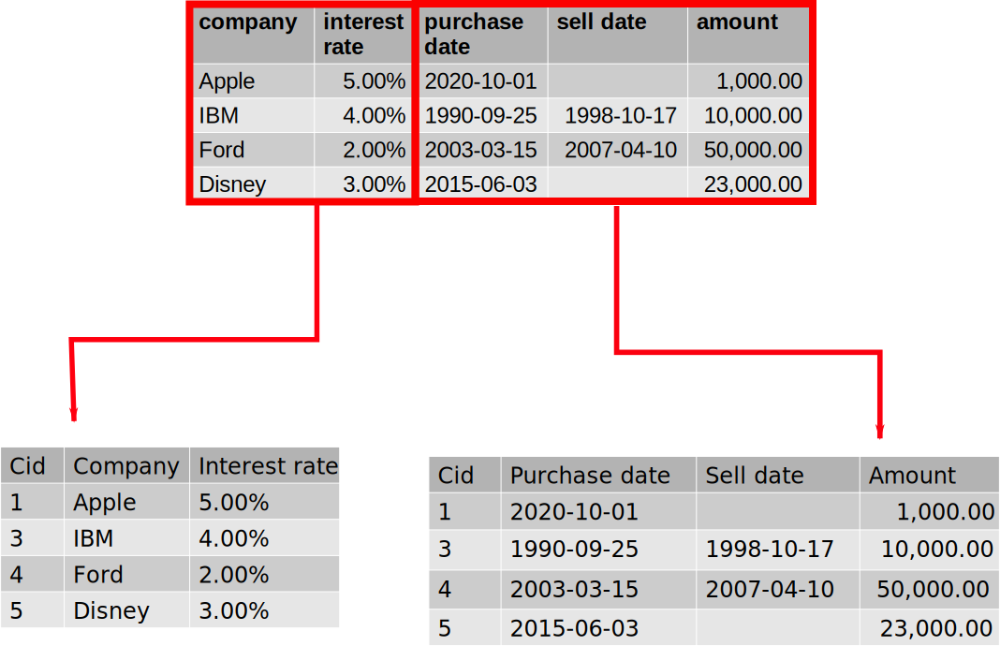

## Revision

relation (table) 
  : the description of a table, including a list of attributes together with any integrity constraints, primary and foreign keys  etc.  

Relational Variable 
  : an actual table with data in it. It is a variable because if data is entered, deleted, edited etc. its actual value will be different, just as a variable in any programming language.  

. . .

Base Relational Variable 
  : a relational variable which actually exists as some form of physical data stored somehow (we don’t care how).

Derived relational variable
  : does not ever exist physically, but remains as a description (expression), evaluated when it is encountered in (say) a program.
  : also known as a *view*

## Views

Derived relational variable
  : does not ever exist physically, but remains as a description (expression), evaluated when it is encountered in (say) a program.
  : also known as a *view*

* *Informally*: a stored, named query
* Is treated just like a table!

::: notes
However, it can be thought of as existing, and a user may not be aware (and
does not care) that it is a view, rather than a table. This is because, as a
description, it has the same type as a Base RV, which in turn means that it
enjoys the same closure properties as a table.
:::

## Example

* **Relational model**

    `Var Good_Supplier view (S where status > 15){S#, Status, City}`

* **SQL**

    ```sql
    CREATE VIEW Good_Supplier as 
    SELECT S#, Status, City 
    FROM S 
    WHERE status > ‘15’;
    ```

This is not evaluated but stored in the catalogue under the name Good_Supplier

## Tricks

* Data alterations in the underlying table are immediately reflected in the view when it is evaluated.
* Data alterations made to the view are reflected in the underlying tables.

## In effect

In a query against a view the view expression is substituted for the view name when evaluation takes place.

`(Good_Supplier where City != ‘London’)`

becomes

`(S where status > 15){S#, Status, City} where City != ‘London)`

or

`(S where Status > 15 and City != ‘London){S#, Status, City}`

::: notes
Good for optimisation!
:::

## Why views?

* **Macro capability**

    ```sql
    Select city from good_supplier where city = 'a city';
    ```

shorthand for the programmers

## Why views?

* **Concurrency**

    Lots of different users "seeing" the same data in different ways. Create 
    a view for each perspective

::::::::: columns
::: column
```sql
CREATE VIEW current_suppliers AS
SELECT Sname, Scity, ...
FROM Supplier
WHERE status > 20;
```

```sql
CREATE VIEW local_suppliers AS
SELECT Sname, Scity, ...
FROM Supplier
WHERE city = 'swansea';
```
:::
::: column
```sql
CREATE VIEW possible_suppliers AS
SELECT Sname, Scity, ...
FROM Supplier
WHERE status = 5;
```

```sql
CREATE VIEW defunt_suppliers AS
SELECT Sname, Scity, ...
FROM Supplier
WHERE status <= 0;
```
:::
::::::::: 

## Why views?

* **Security**

    If a user is only allowed to "see" a particular subset of some data then 
    simply inform them that a specific subset exists 

::::::::: columns
::: column
**Lecturer**

```sql
CREATE VIEW lecturer AS
SELECT name, email, module, photo
FROM students
WHERE is_enrolled = true;
```
:::
::: column
**Administrator**

```sql
CREATE VIEW administrator AS
SELECT name, email, address, has_paid, is_enrolled
FROM students
WHERE year = 2020;
```
:::
::::::::: 

## Why views?

* **Logical Independence**

    Views make your database robust to changes

    Underlying database structure can change but view keeps access consistent

{height=480px}

## Why views?

* **Logical Independence**

    Views make your database robust to changes

    Underlying database structure can change but view keeps access consistent

::::::::: {.columns}
::: {.column}
{height=480px}
:::
::: {.column}
```sql
CREATE VIEW full_portfolio AS
SELECT c.company, c.interest_rate, purchase_date, sell_date, amount
FROM company c, portfolio p
WHERE c.cid=p.cid;
```
:::
:::::::::

## Why views?

* Macro capability
* Concurrency
* Security
* Logical independence

## Summary

* Views are formally known as *derived relational variables*
* Can be treated just like *base RVs* in query statements
* Very useful for:
    - Macro capability
    - Concurrency
    - Security
    - Logical independence


