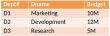
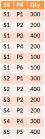
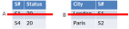
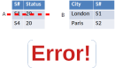
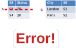

## Outline

* Integrity constraints
* Primary keys
* Foreign keys

## Prelims

Predicate
  : Boolean-valued expression of several variables with quantifiers
  : e.g. $\forall A, B \text{ st } A \land B \rightarrow C \lor D$

Proposition
  : A boolean expression with and, or, not, and if
  : e.g. $A \land B \rightarrow C \lor D$

## What is integrity?

Integrity constraint
  : boolean expression associated with the entire database
  : must evaluate to `true` at all times

* Often corresponds to some buisiness rule

. . .

* **Examples**
    * Each supplier’s status value is in the range 1 to 100 inclusive.
    * Every supplier in London has a status of 20.
    * If there are any parts at all at least one part is blue.
    * No two suppliers have the same supplier number.
    * Each shipment must involve an existing supplier.
    * No supplier, with a status value lower than 20, supplies any part

## Example

::::::::: {.columns}
::: {.column}
```
Constraint SC1: is_empty(S where status < 1 or Status > 100)
```
:::
::: {.column}
```sql
ALTER TABLE Supplier
ADD CONSTRAINT SC1
CHECK (status >= 1 and status <= 100);
```
:::
::::::::: 

* The DBMS will check all attempts to update Supplier table.
* Constraint is given a name (here SC1). This becomes part of the DBMS 
  catalogue and can be used in error messages for example.
* Constraint is checked when created and whether or not the database 
  currently satisfies it. If so it is added, otherwise it is rejected.

## Types of constraints

* `CHECK`
* `NOT NULL`
* `UNIQUE`
* `PRIMARY KEY`
* `FOREIGN KEY`

see <https://mariadb.com/kb/en/constraint/> for more

## Further example

* $$
  \forall \text{S#} \in \text{S}, sn \in name, st \in integer, sc \in char 
  $$
* $$
  (\text{S#}\ sn\ st\ sc) \in \text{S} \rightarrow
    (sc=\text{'London'} \rightarrow st=20)
  $$

::: notes
first if statement checks if record is in db, 2nd checks that london text 
must have status 20
:::

## Formally


* Constraints must evaluate to true at all times
* False rows cannot be included in database

* **Across the database**
    * Constraints are defined as a *predicate*
    * Implicit $\forall$ rows constraint
    * e.g.  $(\text{S#}\ sn\ st\ sc) \in \text{S} \rightarrow (sc=\text{'London'} \rightarrow st=20)$
* **For each row**
    * Constraint is a *proposition*
    * Each row is checked if constraint evaluates to true or false
    * e.g. $sc=\text{'London'} \rightarrow st=20$
        * $\{sc: \text{'London'}, st: 30\} = \text{false}$
        * $\{sc: \text{'Athens'}, st: 30\} = \text{true}$

## RV predicates

Relational variable predicate 
  : logical *and* of all the constraints that refer to that relational variable.

* **Golden Rule (1st version).**
    * No update operation must ever assign to any RV a value that causes 
      its RV Predicate to evaluate to false.

## Database predicate

Database predicate
  : logical *and* of all RV predicates

* **Golden Rule (final version)**
    * No update operation must ever assign to any database a value that 
      causes its Database Predicate to evaluate to false.

## Outline

* Integrity constraints
* **Primary keys**
* Foreign keys

## Candidate keys

Candidate key
  : Set of 1 or more columns such that:

      * **Uniqueness**: unique value inside table
      * **Irreducability**: No subset of set has uniqueness property

There can be more than one such set!

{height="200px"}

## Primary key

* Every relational variable must have at least one *candidate key*
* This is the **primary key**
* Other candidate keys are called **alternate keys**

{height="200px"}

## Outline

* Integrity constraints
* Primary keys
* **Foreign keys**

## Foreign keys

::::::::: {.columns}
::: {.column width="70%"}
Foreign key
  : set of attributes of a given relational variable that must match values
    of a candidate key in another relational variable

* Foreign keys can refer to the same table
* DBMS software will usually require constraints defined on candidate keys

:::
::: {.column width="30%"}

:::
::::::::: 

## Other points

Referential constraint
  : a foreign key value represents a reference to the tuple containing the 
    candidate key value

* Every value in the foreign key column must match a row in the primary key
* Every primary key value does not have to exist as a foreign key (e.g. supplier with no parts)
* Foreign keys and primary keys can be simple or composite

## Referential actions

Sometimes when we specify a delete operation it may have consequences for a
referential constraint

{height="340px"}

Need to specify behaviour for foreign keys:

* cascade
* restrict
* no action

## Cascade

```sql
FOREIGN KEY (S#) references S(S#) on delete cascade
```

Any delete operation carried out on relation S will delete matching tuples in SP (if any).

{height="250px"}

## Restrict

```sql
FOREIGN KEY (S#) references S(S#) on delete restrict
```

Delete operations carried out on S will be restricted to those operations which
have no matching tuples in SP. Otherwise they will be rejected.

{height="450px"}

## No action

```sql
FOREIGN KEY (S#) references S(S#) on delete no action
```

Similar to restrict with identical final result. Restrict carries out check
before delete, no action after.

{height="450px"}

## Summary

* Constraints are predicates that must *always* hold
* Primary key for each table is taken from one of the candidate keys
* Need to specify referential actions when updating/deleting foreign keys

