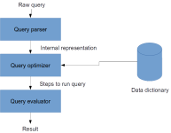

## Optimisation



## Why optimisation?

(SP join S where P# = “P2”) {SNAME}

* Assume 100 suppliers and 10,000 shipments of which 50 are for part P2
* Assume SP and P are stored a separate single files on disk

## Why optimisation?

(SP join S where P# = “P2”) {SNAME}

```
(SP join S) = // 10,000 tuples
  For each tuple in SP: // 10,000 tuples
    For each tuple in S: // 100 tuples
      See if SP.S# = S.S# // 1,000,000 checks total
(SP join S where P#=”P2” = // 50 tuples
  For each tuple in (SP join S): // 10,000 tuples
    See if P# = “P2” // 10,000 checks
(SP join S where P#=”P2”){SName} = // 50 projects
  For each tuple in (SP join S where P#=”P2”): // 50 tuples
    Project SName
```

**Total operations**: $1,000,000 + 10,000 + 50 = 1,010,050$ tuple operations

## Why optimisation?

(SP join S where P# = “P2”) {SNAME}

```
(SP where P#=”P2”) = // 50 tuples
  For each tuple in SP: // 10,000 tuples
    See if P# = “P2” // 10,000 checks
(SP join S where P#=”P2” = // 50 tuples
  For each tuple in (SP where P#=”P2”): // 50 tuples
    For each tuple in S: // 100 tuples
      See if SP.S#=S.S#  // 5,000 checks
(SP join S where P#=”P2”){SName} = // 50 projects
  For each tuple in (SP join S where P#=”P2”): // 50 tuples
    Project SName
```

**Total operations**: $10,000 + 5,000 + 50 = 15,050$ tuple operations

## Why automatic optimisation?

* Data is stored somewhere. We don't know where
* We don't know what data exists
* We don't know how much data exists
* We won't know when the data has changed
* The optimiser is a program and doesn’t get impatient
* The optimiser embodies the skill of the best programmers – making a 
  precious resource available to all

## How to inspect the query plan

```sql
EXPLAIN <sql query>
```

Example

```sql
EXPLAIN SELECT *
FROM Employee e, Department d
WHERE e.did=d.did;
```

more info: <https://dev.mysql.com/doc/refman/5.7/en/using-explain.html>

## Optimization overview

::::::::: {.columns}
::: {.column}

:::
::: {.column}
1. Cast query into internal form
2. Convert to canonical form
3. Choose candidate low-level procedures
4. Generate query plans and choose cheapest
:::
:::::::::

## Cast query to internal form

::::::::: {.columns}
::: {.column}

:::
::: {.column}
* Conversion into internal form eliminates external considerations 
  (such as SQL quirks)
    * Includes creating actual view instead of just reference to relational 
      expression
    * Usually some kind of abstract syntax tree or query tree
    * For convenience we’ll stick with relational algebra
:::
:::::::::

## Convert to canonical form

::::::::: {.columns}
::: {.column}

:::
::: {.column}
* Canonical form gives an expected starting point for the optimizer to reason about
* Given a set $Q$ of queries $q$, a canonical set $C$ is a subset of $Q$ such that:
    * For each $q$ in $Q$ there exists precisely one element $c \in C$ which 
      is equivalent – in that it will produce exactly the same result.
    * Uses transformational rules such as: 

      `(A join B) where restriction on A`

      *becomes*

      `(A where restriction on A) join B`
:::
:::::::::

## Choose candidate low-level procedures

::::::::: {.columns}
::: {.column}

:::
::: {.column}

* **Consider**:
    - …existence or not of indexes,
    - …physical access paths,
    - …distribution of data values,
    - …physical clustering of data
* **For each low-level operation** 
    * optimiser will have a set of pre-defined implementation procedures
    * e.g. Restriction
	    - One for where restriction is equality comparison
	    - One where it is indexed
	    - One where it is hashed
    * associated cost, such as disk I/O

:::
:::::::::

## Generate query plans and choose cheapest

::::::::: {.columns}
::: {.column}

:::
::: {.column}

* Combine a set of low-level procedures
    * **NOTE**: not possible to enumerate *all* possible plans
    * Some kind of heuristic to find optimal queries
    * Cost for each plan is combined cost of individual procedures

:::
:::::::::

## How to improve performance

* Use `EXPLAIN`!
* Create indexes on join columns

    ```sql
    CREATE INDEX <index name> 
    ON <table name> (<col1, col2, ...>);
    ```

* Think about splitting up huge tables (aka **sharding**)

More info: <https://dev.mysql.com/doc/refman/8.0/en/create-index.html>

## Summary

* Most DBMS have an automatic query optimizer
* Use `EXPLAIN` to see what the database will do
* SQL optimization is similar to other code optimization

