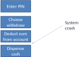
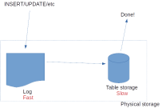
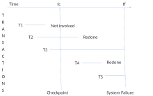

## Who is responsible

* **Single-user non-shared database**: 
    * User 
    * e.g. regular backups
* **Shared multi-user database**: 
    * DBMS 
    * Algorithms to enable recovery

## Why?

system crash renders database "incorrect" or at least suspect

{height="500px"}

## ACID principle

Data validity in the face of crashes

* **(A)tomic**: A transaction is all or nothing.
* **(C)orrect**: A transaction transforms a correct state into another correct state, without necessarily preserving correctness at all intermediate points.
* **(I)solated**: A transaction should be hidden from any other transactions taking place simultaneously.
* **(D)urable**: Once a transaction commits, its updates persist, even if there is a subsequent system crash.

## How?

* **Recovery**
    * Data can only be recovered if it is stored redundantly
    * *Note*: redundancy in physical storage, NOT logical redundancy
* **Transaction**
    * Logical unit of work
    * Either complete transaction is carried out or nothing is altered

::::::::: {.columns}
::: {.column}
**MySQL**

```sql
START TRANSACTION
-- bunch of sql statements
COMMIT or ROLLBACK
```
:::
::: {.column}
**Other databases**

```sql
BEGIN TRANSACTION
-- bunch of sql statements
COMMIT or ROLLBACK
```
:::
:::::::::

## Ending transactions

* **Commit**
    * Indicates successful end-of-transaction
    * Record logical unit of work in database.
* **Rollback**
    * Indicates unsuccessful end-of-transaction 
    * Something has gone wrong, the database might be in an incorrect state
    * Undo all updates in transaction

## Commits

Commit point 
  : states that the database is logically correct at this point.
  : aka Sync point

How to ensure data is not lost to crashes?

::: notes
(Write-ahead log rule)
:::

## Write-ahead log

::::::::: {.columns}
::: {.column width="60%"}

:::
::: {.column width="40%"}
1. Write transaction record to log file
2. Copy transactions from log to table storage
3. Remove transactions from log file
:::
::::::::: 

## Rollbacks

* A single statement may result in updates to several tuples 
* If some are done and not others then ALL must be undone

Explicit rollback
  : Rollback statement issued by programmer

Implicit rollback
  : Internal failure triggers undoes changes
  : triggered by DBMS


## System recovery

::::::::: {.columns}
::: {.column}

:::
::: {.column}
Soft crash 
  : in-progress transactions lost
  : database not physically damaged
  : e.g. a powercut

* *In-progress transactions* are undone
* *Completed but un-stored transactions* are redone
:::
::::::::: 

## Recovery algorithm


1. Start with two lists of transactions, UNDO and REDO.
2. UNDO equals all transactions given in the most recent checkpoint. REDO is empty.
3. Search forward in the log, starting from the checkpoint.
4. If a begin transaction record is found for transaction t, then add t to UNDO.
5. If a commit record is found for transaction t, then move t from UNDO to REDO.
6. When the end of the log is found UNDO and REDO identifies correct procedure.

{height="400px"}

## Checkpoints

Checkpoint
  : System snapshot at prescribed intervals

* Memory buffers flushed to disk
* Write-ahead log flushed to long-term storage

## Summary

* Transactions break work down into logical units
* Write-ahead log allows us to recover from crashes
* ACID principle guarantees data validity desite crashes

