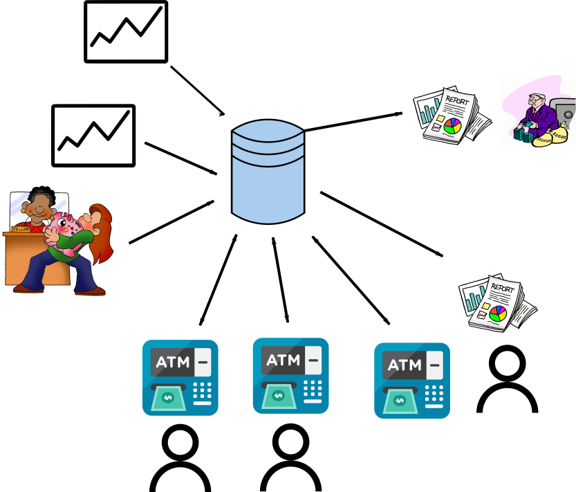
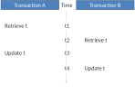
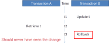
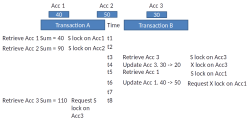
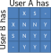
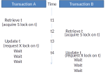
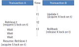
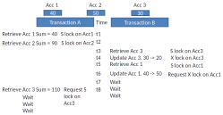
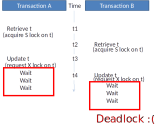
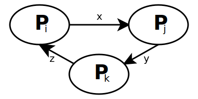

## Shared data

::::::::: {.columns}
::: {.column}
* Data is shared by multiple connections
* Many connections per person/application
* Each connection may read/write the same data
:::
::: {.column}

:::
:::::::::

## Multiple transactions

* Transaction A and Transaction B – each correct in itself
* A and B run concurrently = **Problems**
    1. Lost Update Problem 
    2. Uncommitted Dependency Problem
    3. Inconsistent Analysis Problem

::: notes
Analogy here is to a google doc
:::

## Lost update problem

Lost update problem
  : Multiple transcations update the same column at the same time
  : Certain changes may be lost

{height=600px}

## Uncommitted Dependency Problem

Uncommitted dependency problem
  : One transaction sees results of another before other commits its changes

{height=600px}

## Inconsistent Analysis Problem

Inconsistent analysis problem
  : One transaction reads data after another updates results

{height=600px}

## Locking

* **Locking** prevents multiple transactions from accessing same data at same time

* **Exclusive locks**(X)
    * No other users may access
    * aka write locks
* **Shared locks**(S)
    * Other users may read data but not write
    * aka read locks

{height="270px"}

## Locking protocol


```
For each tuple:
  gain S lock or wait in queue
  if writing needed:
    gain X lock or wait in queue
```

{height="450px"}


## Lost Update Problem (solved)

{height=600px}

## Uncommitted Dependency Problem (solved)

{height=600px}

## Inconsistent Analysis Problem (solved)

{height=600px}

## Waiting for shared resourc

{height="700px"}

## Deadlock

Deadlock
  : 2 or more transactions are each waiting for a shared resource, held by 
    the other transaction

* **Resolution**
    * Ideally DBMS detects and resolves these
    * DBMS maintains Wait-for graph for tuples
    * Cycles in graph are deadlocks
    * Pick a transaction and rollback or restart 

{height="200px"}

::: notes
* When a transaction is forcibly rolled back it has failed through no fault of its own.
* Either restart failed transaction assuming that the reason for failing will not reoccur.
* Or send a "failed transaction" message to application and let that deal with it (without informing the end-user).
:::

## Deadlock prevention


* Each transaction is time stamped with its (unique) start time
* Transaction A requests a lock already locked by Transaction B.

wait-die
  : If A is older than B it waits, otherwise it dies. (A is rolled back and restarted)
  : A is impatient

wound-wait 
  : If A is younger than B it waits, otherwise it "wounds" B. (B is rolled back and restarted). 
  : A is lazy

MySQL uses wait-die but also looks at size of transaction:
<https://dev.mysql.com/doc/refman/8.0/en/innodb-deadlocks.html>

::: notes
Preventing deadlocks in the first place
:::

## Summary

* Issues when multiple users want access to the same data
    - Lost Update Problem 
    - Uncommitted Dependency Problem
    - Inconsistent Analysis Problem
* Locks prevent data inconsistencies
* Deadlocks are a big problem

